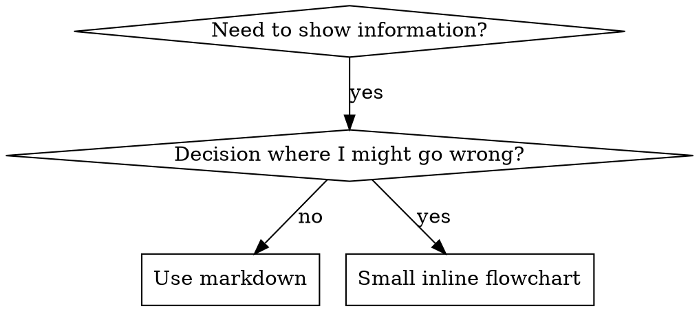

# Writing Skills

## Overview

**Writing skills IS Test-Driven Development applied to process documentation.**

**Skills are stored in `.gemini/skills/` (project-local) or `~/.gemini/skills/` (user-global).** You edit skills directly in the project's codebase.

You write test cases (pressure scenarios with subagents), watch them fail (baseline behavior), write the skill (documentation), watch tests pass (agents comply), and refactor (close loopholes).

**Core principle:** If you didn't watch an agent fail without the skill, you don't know if the skill teaches the right thing.

See `skills/testing/test-driven-development` for the fundamental RED-GREEN-REFACTOR cycle. This skill adapts TDD to documentation.

## What is a Skill?

A **skill** is a reference guide for proven techniques, patterns, or tools. Skills help future Agent instances find and apply effective approaches.

**Skills are:** Reusable techniques, patterns, tools, reference guides

**Skills are NOT:** Narratives about how you solved a problem once

## When to Create a Skill

**Create when:**

- Technique wasn't intuitively obvious to you
- You'd reference this again across projects
- Pattern applies broadly (not project-specific)
- Others would benefit

**Don't create for:**

- One-off solutions
- Standard practices well-documented elsewhere
- Project-specific conventions (put in `GEMINI.md`)

## When to Use This Skill

**Situations:**

- When you discover a technique, pattern, or tool worth documenting for reuse.
- When editing existing skills.
- When asked to modify skill documentation.
- When you've written a skill and need to verify it works before deploying.

## TDD Mapping for Skills

| TDD Concept             | Skill Creation                                   |
| ----------------------- | ------------------------------------------------ |
| **Test case**           | Pressure scenario with subagent                  |
| **Production code**     | Skill document (SKILL.md)                        |
| **Test fails (RED)**    | Agent violates rule without skill (baseline)     |
| **Test passes (GREEN)** | Agent complies with skill present                |
| **Refactor**            | Close loopholes while maintaining compliance     |
| **Write test first**    | Run baseline scenario BEFORE writing skill       |
| **Watch it fail**       | Document exact rationalizations agent uses       |
| **Minimal code**        | Write skill addressing those specific violations |
| **Watch it pass**       | Verify agent now complies                        |
| **Refactor cycle**      | Find new rationalizations → plug → re-verify     |

The entire skill creation process follows RED-GREEN-REFACTOR.

## Skill Types

### Technique

Concrete method with steps to follow (condition-based-waiting, root-cause-tracing)

### Pattern

Way of thinking about problems (flatten-with-flags, test-invariants)

### Reference

API docs, syntax guides, tool documentation

## Directory Structure

**All skills are stored in `.gemini/skills/`:**

```
.gemini/skills/
  skill-name/
    SKILL.md              # Main reference (required)
    supporting-file.*     # Only if needed
```

**Flat namespace** - all skills in one searchable location

**Separate files for:**

1. **Heavy reference** (100+ lines) - API docs, comprehensive syntax
2. **Reusable tools** - Scripts, utilities, templates

**Keep inline:**

- Principles and concepts
- Code patterns (< 50 lines)
- Everything else

## SKILL.md Structure

```markdown
---
name: Human-Readable Name
description: One-line summary of what this does (ASO-critical)
version: 1.0.0
---

# Skill Name

## Overview

What is this? Core principle in 1-2 sentences.

## When to Use

[Small inline flowchart IF decision non-obvious]

Bullet list with SYMPTOMS and use cases
When NOT to use

## Core Pattern (for techniques/patterns)

Before/after code comparison

## Quick Reference

Table or bullets for scanning common operations

## Implementation

Inline code for simple patterns
Link to file for heavy reference or reusable tools

## Common Mistakes

What goes wrong + fixes

## Real-World Impact (optional)

Concrete results
```

## Agent Search Optimization (ASO)

**Critical for discovery:** Future Agents need to FIND your skill.

### 1. Rich Description

Include SYMPTOMS and key keywords in the `description` field, as this is the primary discovery mechanism:

```yaml
# ❌ BAD: Too abstract
description: For async testing

# ✅ GOOD: Symptoms and context
description: Fix flaky async tests using condition-based waiting. Handles timeouts, race conditions, and CI failures.
```

### 2. Keyword Coverage

Use words an Agent would search for:

- Error messages: "Hook timed out", "ENOTEMPTY", "race condition"
- Symptoms: "flaky", "hanging", "zombie", "pollution"
- Synonyms: "timeout/hang/freeze", "cleanup/teardown/afterEach"
- Tools: Actual commands, library names, file types

### 3. Descriptive Naming

**Use active voice, verb-first:**

- ✅ `creating-skills` not `skill-creation`
- ✅ `testing-skills-with-subagents` not `subagent-skill-testing`

### 4. Token Efficiency (Critical)

**Problem:** Skills are loaded into the Agent's context. Every token counts.

**Target word counts:**

- Getting-started workflows: <150 words each
- Other skills: <500 words (be concise)

**Techniques:**

**Move details to tool help:**

```bash
# ✅ GOOD: Reference --help
npm run test -- --help
```

**Use cross-references:**

```markdown
# ✅ GOOD: Reference other skill

Always use subagents. See `skills/getting-started` for workflow.
```

**Eliminate redundancy:**

- Don't repeat what's in cross-referenced skills
- Don't explain what's obvious from context

**Name by what you DO or core insight:**

- ✅ `condition-based-waiting` > `async-test-helpers`
- ✅ `using-skills` not `skill-usage`
- ✅ `flatten-with-flags` > `data-structure-refactoring`
- ✅ `root-cause-tracing` > `debugging-techniques`

**Gerunds (-ing) work well for processes:**

- `creating-skills`, `testing-skills`, `debugging-with-logs`

### 4. Content Repetition

Mention key concepts in the description, overview, and section headers to increase Grep hits.

### 5. Cross-Referencing Other Skills

Use path format relative to the skills root:

- ✅ Good: `skills/testing/test-driven-development`

## Flowchart Usage



**Use flowcharts ONLY for:**

- Non-obvious decision points
- Process loops where you might stop too early

See `docs/ui-patterns/graphviz-conventions.dot` for graphviz style rules.

## Code Examples

**One excellent example beats many mediocre ones.**

**Good example:**

- Complete and runnable
- Well-commented explaining WHY
- From real scenario
- Shows pattern clearly

## The Iron Law (Same as TDD)

```
NO SKILL WITHOUT A FAILING TEST FIRST
```

This applies to NEW skills AND EDITS to existing skills.

Write skill before testing? Delete it. Start over.
Edit skill without testing? Same violation.

**No exceptions:**

- Not for "simple additions"
- Not for "just adding a section"
- Not for "documentation updates"
- Delete means delete

See `skills/testing/test-driven-development` for why this matters.

## Testing All Skill Types

### Discipline-Enforcing Skills

**Test with:** Pressure scenarios (time + sunk cost + exhaustion). Identify rationalizations and add counters.

### Technique Skills

**Test with:** Application scenarios. Can the Agent apply the technique to new scenarios?

### Pattern Skills

**Test with:** Recognition scenarios. Does the Agent know when pattern applies?

### Reference Skills

**Test with:** Retrieval scenarios. Can the Agent find and use the right info?

## Common Rationalizations for Skipping Testing

| Excuse                     | Reality                                        |
| -------------------------- | ---------------------------------------------- |
| "Skill is obviously clear" | Clear to you ≠ clear to other agents. Test it. |
| "Testing is overkill"      | Untested skills have issues. Always.           |
| "I'm confident it's good"  | Overconfidence guarantees issues. Test anyway. |

## Bulletproofing Skills Against Rationalization

### Close Every Loophole Explicitly

Forbid specific workarounds:

```markdown
Write code before test? Delete it. Start over.
**No exceptions:** Don't keep it as "reference". Delete means delete.
```

### Build Rationalization Table

Capture excuses from baseline testing and provide counters.

### Create Red Flags List

```markdown
## Red Flags - STOP and Start Over

- Code before test
- "I already manually tested it"
- "It's about spirit not ritual"
```

## RED-GREEN-REFACTOR for Skills

### RED: Write Failing Test (Baseline)

Run scenario with subagent WITHOUT the skill. Document baseline behavior and rationalizations verbatim.

### GREEN: Write Minimal Skill

Write skill addressing those specific failures. Verify Agent now complies.

### REFACTOR: Close Loopholes

Add explicit counters for any new rationalizations found during testing.

## STOP: Before Moving to Next Skill

**After writing ANY skill, you MUST STOP and complete the verification process.**

**Do NOT:**

- Create multiple skills in batch without testing each.
- Skip testing because "batching is more efficient".

## Skill Creation Checklist

- [ ] Create pressure scenarios
- [ ] Run scenarios WITHOUT skill - document baseline behavior
- [ ] Name describes what you DO
- [ ] Frontmatter with rich description (primary discovery)
- [ ] Address baseline failures
- [ ] One excellent example
- [ ] Run scenarios WITH skill - verify compliance
- [ ] Identify NEW rationalizations and add explicit counters
- [ ] Re-test until bulletproof

## Discovery Workflow

How future Agents find your skill:

1. **Encounter problem** ("tests are flaky")
2. **Automatic Discovery** (Agent scans `.gemini/skills/` descriptions)
3. **Finds SKILL.md** (rich description matches)
4. **Scans overview** (is this relevant?)
5. **Reads patterns** (quick reference table)

## The Bottom Line

**Creating skills IS TDD for process documentation.**

Same Iron Law: No skill without failing test first.
Same cycle: RED (baseline) → GREEN (write skill) → REFACTOR (close loopholes).
Same benefits: Better quality, fewer surprises, bulletproof results.
