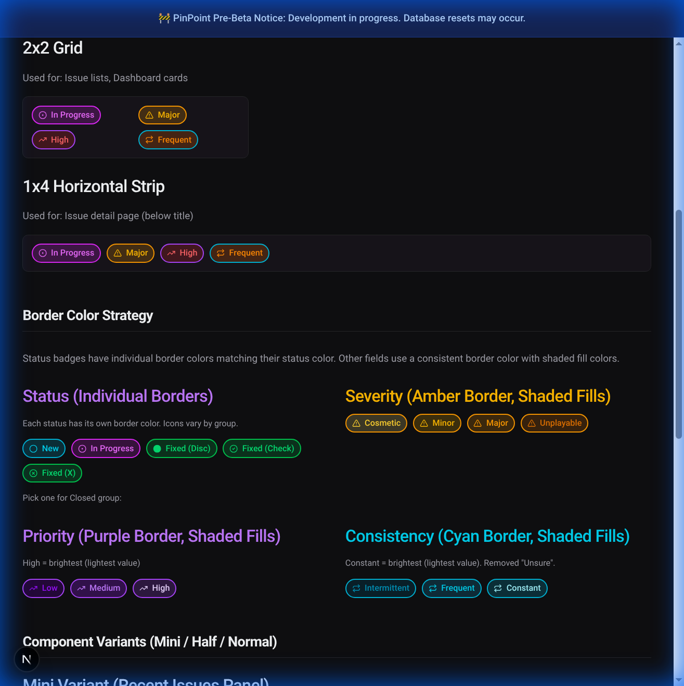
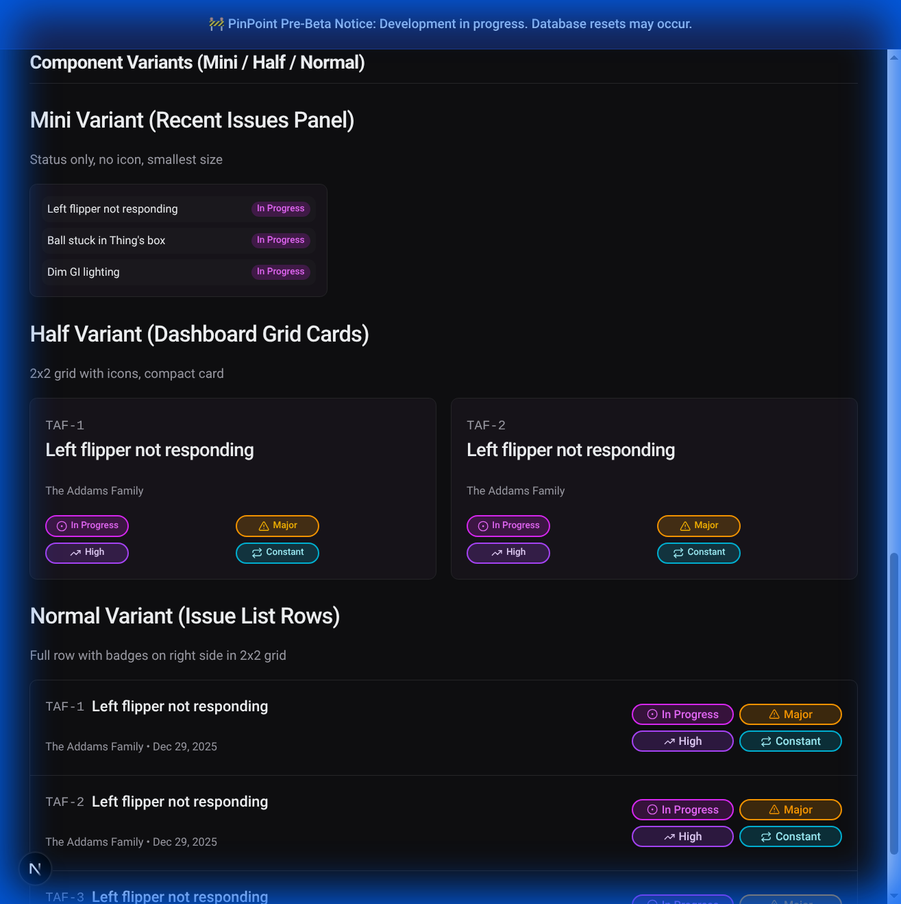
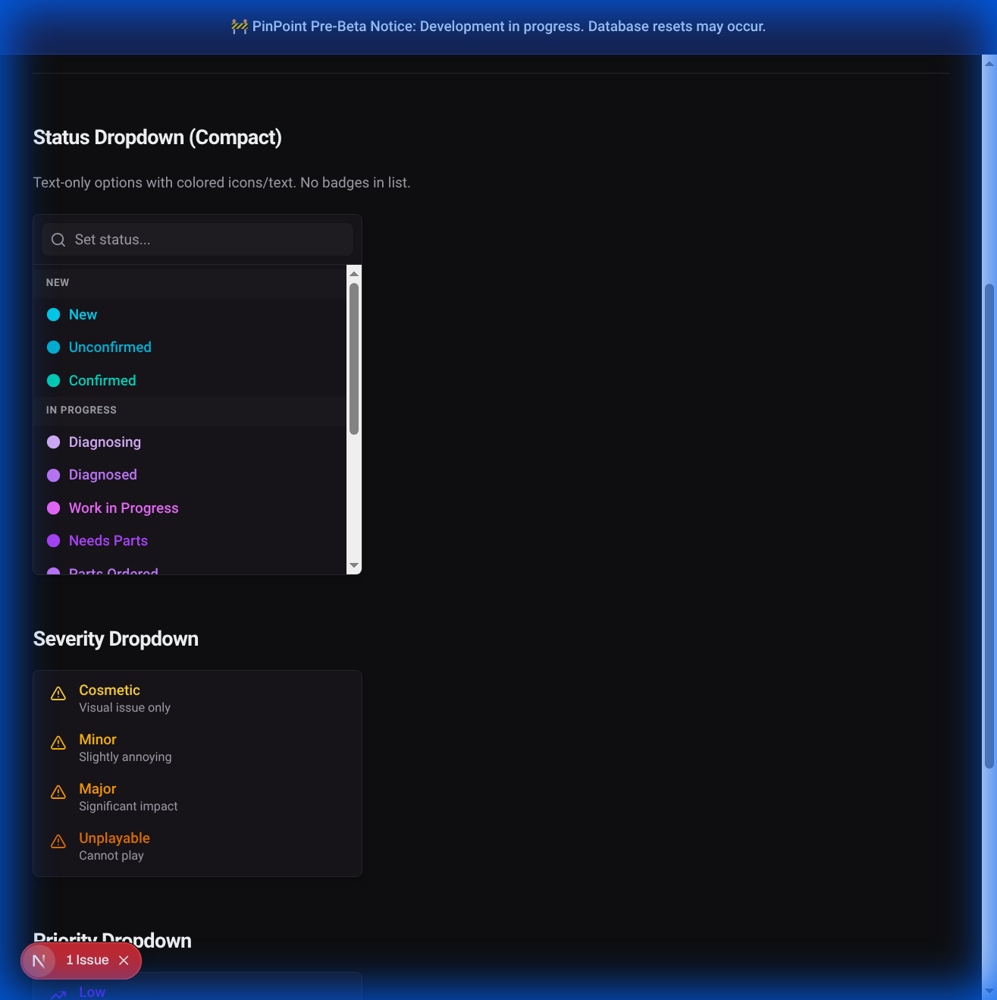
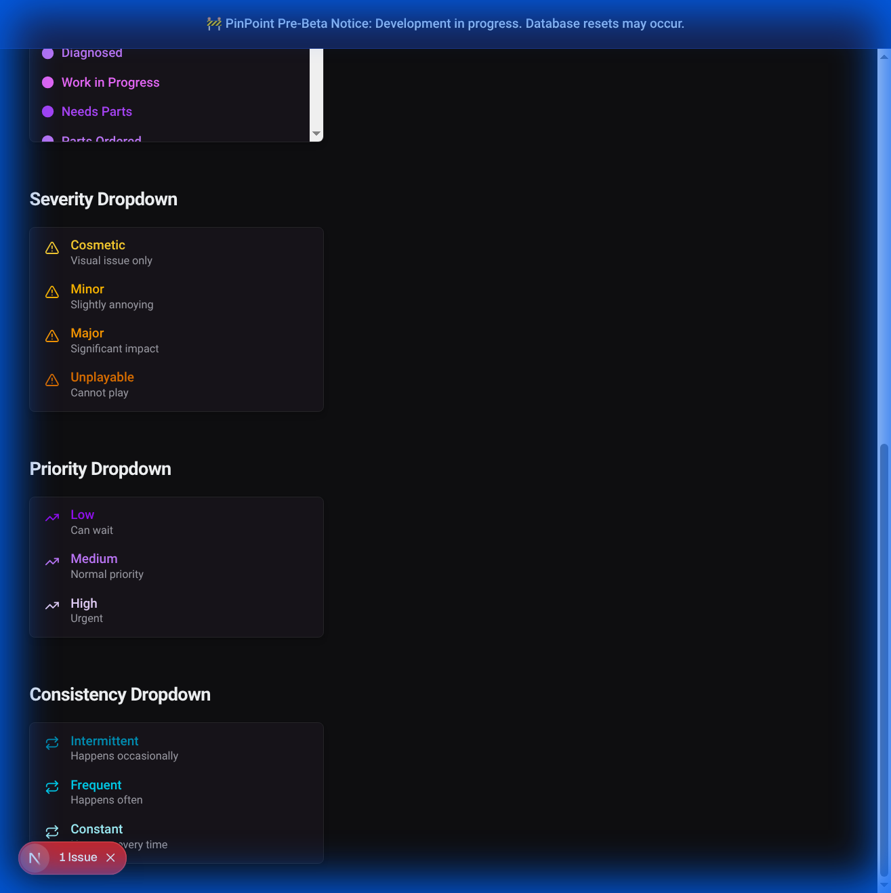

# Issue Status System Redesign - Final Implementation Plan

## Current Status (January 8, 2026)

We are in the final stages of the status overhaul. Key updates include:

- **Terminology Standardization**: Consistently using **"Fixed"** instead of "resolved" across the application, logic, and tests.
- **Badge Integration**: The `IssueBadgeGrid` (vibrant, icon-based badges) is now integrated into the Dashboard, Issue List, and Recent Issues panel.
- **Schema Alignment**: The database schema and TypeScript types have been reconciled to follow the 11-status specification (New, Confirmed, Waiting on Owner, Work in Progress, Needs Parts, Needs Expert Help, Fixed, Works as Intended, Won't Fix, Not Reproducible, Duplicate).
- **Seed Data Enhancement**: `supabase/seed-users.mjs` has been updated to use the new status/severity system and includes detailed timeline historical events (comments) for test machines like _The Addams Family_.
- **ARIA & Accessibility**: All status/severity/priority update forms now include proper `aria-label` attributes for accessibility and reliable E2E testing.
- **Migration Consolidation**: All previous migrations (0000-0007) have been consolidated into a single clean `0000_init-schema.sql` for the V2 launch.

---

**Last Updated**: January 7, 2026
**Status**: Ready for Implementation

---

## Overview

Redesigning the issue status system to provide richer metadata through **four key fields**:

| Field           | Purpose              | Values                             | Public Report Form        |
| --------------- | -------------------- | ---------------------------------- | ------------------------- |
| **Status**      | Lifecycle state      | 11 statuses in 3 groups            | No (defaults to "New")    |
| **Severity**    | Gameplay impact      | Cosmetic, Minor, Major, Unplayable | Yes                       |
| **Priority**    | Work urgency         | Low, Medium, High                  | No (defaults to "Medium") |
| **Consistency** | How often it happens | Intermittent, Frequent, Constant   | Yes                       |

> **Note**: The "Public Report Form" column indicates which fields are available when the public reports a new issue. Members and admins can edit **all fields** after issue creation (same permissions as editing issues).

---

## Visual Mockups

> [!WARNING]
> **Mockups Created Before Finalization**: The screenshots below were created during the design phase and show outdated field values (14 statuses instead of 11) and extra descriptions that have been removed. Use these mockups for **visual layout and styling reference only**. Refer to the "Field Specifications" section for the final, authoritative list of values.

### Badge Layouts



- **2x2 Grid**: Used in issue lists and dashboard cards
- **1x4 Horizontal Strip**: Used on issue detail pages

### Component Variants



- **Mini**: Recent issues sidebar (status only, no icon)
- **Half**: Dashboard cards (2x2 grid, compact sizing)
- **Normal**: Issue list rows (2x2 grid, standard sizing)

### Dropdown Designs



Status dropdown uses `<optgroup>` tags to visually separate groups.



---

## Field Specifications

### Status Field (11 values in 3 groups)

| Group           | Icon        | Values                                                             |
| --------------- | ----------- | ------------------------------------------------------------------ |
| **New**         | `Circle`    | New, Confirmed                                                     |
| **In Progress** | `CircleDot` | Waiting on Owner, Work in Progress, Needs Parts, Needs Expert Help |
| **Closed**      | `Disc`      | Fixed, Works as Intended, Won't Fix, Not Reproducible, Duplicate   |

**Status Descriptions**:

| Status            | Description                              |
| ----------------- | ---------------------------------------- |
| New               | Just reported, needs triage              |
| Confirmed         | Verified as a real issue                 |
| Waiting on Owner  | Blocked on machine owner decision/action |
| Work in Progress  | Active repair underway                   |
| Needs Parts       | Waiting on new parts                     |
| Needs Expert Help | Escalated to expert                      |
| Fixed             | Issue is resolved                        |
| Works as Intended | Not a bug, it's a feature                |
| Won't Fix         | Too minor or risky to fix                |
| Not Reproducible  | Couldn't make it happen again            |
| Duplicate         | Already reported elsewhere               |

**Rules**:

- Default: "New"
- Issues marked "Duplicate" are hidden from public "Recent Issues" panels
- Each status has its own border color matching the status color

### Severity Field (4 values)

| Value      | Intensity      |
| ---------- | -------------- |
| Cosmetic   | Lightest amber |
| Minor      | Light amber    |
| Major      | Medium amber   |
| Unplayable | Darkest amber  |

**Default**: Minor
**Border**: Consistent `border-amber-500`

### Priority Field (3 values)

| Value  | Intensity        |
| ------ | ---------------- |
| Low    | Darkest purple   |
| Medium | Medium purple    |
| High   | Brightest purple |

**Default**: Medium
**Border**: Consistent `border-purple-500`
**Note**: Members only (hidden from guests)

### Consistency Field (3 values)

| Value        | Intensity      |
| ------------ | -------------- |
| Intermittent | Darkest cyan   |
| Frequent     | Medium cyan    |
| Constant     | Brightest cyan |

**Default**: Intermittent
**Border**: Consistent `border-cyan-500`
**Display**: Issue detail and issue list only (not in recent issues)

---

## Design System

### Icons

```
Status:      Circle (New) | CircleDot (In Progress) | Disc (Closed)
Severity:    AlertTriangle (all values)
Priority:    TrendingUp (all values)
Consistency: Repeat (all values)
```

### Badge Sizing

```
Half variant:   min-w-[90px]
Normal variant: min-w-[110px]
```

### Tooltips (Accessibility)

All badges must include tooltips identifying the field type:

- Format: "Status: In Progress", "Severity: Major", etc.
- Use `title` attribute or shadcn/ui Tooltip component

---

## Database Schema

```typescript
// src/server/db/schema.ts
export const issues = pgTable("issues", {
  // ... existing fields ...

  status: text("status", {
    enum: [
      // New group
      "new",
      "confirmed",
      // In Progress group
      "waiting_on_owner",
      "in_progress",
      "needs_parts",
      "needs_expert",
      // Closed group
      "fixed",
      "wont_fix",
      "works_as_intended",
      "not_reproducible",
      "duplicate",
    ],
  })
    .notNull()
    .default("new"),

  severity: text("severity", {
    enum: ["cosmetic", "minor", "major", "unplayable"],
  })
    .notNull()
    .default("minor"),

  priority: text("priority", {
    enum: ["low", "medium", "high"],
  })
    .notNull()
    .default("medium"),

  consistency: text("consistency", {
    enum: ["intermittent", "frequent", "constant"],
  })
    .notNull()
    .default("intermittent"),
});
```

### Migration Steps

1. `npm run db:generate -- --name issue-status-redesign`
2. Review generated migration
3. **IMPORTANT**: Requires full DB reset (no migration path for enum changes)
4. `npm run db:reset` (local dev only)
5. Update seed data

---

## Type Definitions

```typescript
// src/lib/types/database.ts

export type IssueStatus =
  | "new"
  | "confirmed"
  | "waiting_on_owner"
  | "in_progress"
  | "needs_parts"
  | "needs_expert"
  | "fixed"
  | "wont_fix"
  | "works_as_intended"
  | "not_reproducible"
  | "duplicate";

export type IssueStatusGroup = "new" | "in_progress" | "closed";

export type IssueSeverity = "cosmetic" | "minor" | "major" | "unplayable";
export type IssuePriority = "low" | "medium" | "high";
export type IssueConsistency = "intermittent" | "frequent" | "constant";
```

---

## Utility Functions

```typescript
// src/lib/issues/status.ts

import { Circle, CircleDot, Disc } from "lucide-react";

export const STATUS_GROUPS = {
  new: ["new", "confirmed"],
  in_progress: [
    "waiting_on_owner",
    "in_progress",
    "needs_parts",
    "needs_expert",
  ],
  closed: [
    "fixed",
    "wont_fix",
    "works_as_intended",
    "not_reproducible",
    "duplicate",
  ],
} as const;

export function getIssueStatusIcon(status: IssueStatus) {
  if (STATUS_GROUPS.new.includes(status)) return Circle;
  if (STATUS_GROUPS.in_progress.includes(status)) return CircleDot;
  return Disc;
}

export function getIssueStatusLabel(status: IssueStatus): string {
  const labels: Record<IssueStatus, string> = {
    new: "New",
    confirmed: "Confirmed",
    waiting_on_owner: "Waiting on Owner",
    in_progress: "Work in Progress",
    needs_parts: "Needs Parts",
    needs_expert: "Needs Expert Help",
    fixed: "Fixed",
    wont_fix: "Won't Fix",
    works_as_intended: "Works as Intended",
    not_reproducible: "Not Reproducible",
    duplicate: "Duplicate",
  };
  return labels[status];
}
```

---

## Badge Styles Reference

```typescript
// Status styles - individual border colors per status
const STATUS_STYLES = {
  // New group - Cyan
  new: "bg-cyan-500/20 text-cyan-400 border-cyan-500",
  confirmed: "bg-teal-500/20 text-teal-400 border-teal-500",
  // In Progress group - Purple/Fuchsia
  waiting_on_owner: "bg-purple-500/20 text-purple-400 border-purple-500",
  in_progress: "bg-fuchsia-500/20 text-fuchsia-400 border-fuchsia-500",
  needs_parts: "bg-purple-600/20 text-purple-300 border-purple-600",
  needs_expert: "bg-pink-500/20 text-pink-400 border-pink-500",
  // Closed group - Green/Gray
  fixed: "bg-green-500/20 text-green-400 border-green-500",
  works_as_intended: "bg-emerald-500/20 text-emerald-400 border-emerald-500",
  wont_fix: "bg-zinc-500/20 text-zinc-400 border-zinc-500",
  not_reproducible: "bg-slate-500/20 text-slate-400 border-slate-500",
  duplicate: "bg-neutral-600/20 text-neutral-400 border-neutral-600",
};

// Severity - Amber scale (darker = more severe)
const SEVERITY_STYLES = {
  cosmetic: "bg-amber-200/20 text-amber-300 border-amber-500",
  minor: "bg-amber-400/20 text-amber-400 border-amber-500",
  major: "bg-amber-500/20 text-amber-500 border-amber-500",
  unplayable: "bg-amber-600/20 text-amber-600 border-amber-500",
};

// Priority - Purple scale (brighter = higher priority)
const PRIORITY_STYLES = {
  low: "bg-purple-950/50 text-purple-600 border-purple-500",
  medium: "bg-purple-900/50 text-purple-400 border-purple-500",
  high: "bg-purple-500/20 text-purple-200 border-purple-500",
};

// Consistency - Cyan scale (brighter = more consistent)
const CONSISTENCY_STYLES = {
  intermittent: "bg-cyan-950/50 text-cyan-600 border-cyan-500",
  frequent: "bg-cyan-900/50 text-cyan-400 border-cyan-500",
  constant: "bg-cyan-500/20 text-cyan-200 border-cyan-500",
};
```

> [!NOTE]
> **Future Improvement**: The current color scales for Severity, Priority, and Consistency fields need more visual distinction between values. This will be addressed in a future iteration to make it easier to differentiate values at a glance.

---

## New Component: IssueBadgeGrid

```typescript
// src/components/issues/IssueBadgeGrid.tsx

interface IssueBadgeGridProps {
  issue: Issue;
  variant: "mini" | "half" | "normal";
}

export function IssueBadgeGrid({ issue, variant }: IssueBadgeGridProps) {
  if (variant === "mini") {
    // Status only, no icon, smallest size
    return (
      <Badge className="px-1.5 py-0 text-[10px] h-4 ...">
        {getIssueStatusLabel(issue.status)}
      </Badge>
    );
  }

  // 2x2 grid for half and normal variants
  return (
    <div className={cn(
      "grid grid-cols-2 gap-1.5",
      variant === "half" ? "gap-1" : "gap-1.5"
    )}>
      <Badge title={`Status: ${getIssueStatusLabel(issue.status)}`} ...>
        <StatusIcon /> {getIssueStatusLabel(issue.status)}
      </Badge>
      <Badge title={`Severity: ${issue.severity}`} ...>
        <AlertTriangle /> {issue.severity}
      </Badge>
      <Badge title={`Priority: ${issue.priority}`} ...>
        <TrendingUp /> {issue.priority}
      </Badge>
      <Badge title={`Consistency: ${issue.consistency}`} ...>
        <Repeat /> {issue.consistency}
      </Badge>
    </div>
  );
}
```

---

## Files to Update

### Components

- `src/components/issues/IssueRow.tsx` - Use `<IssueBadgeGrid variant="normal" />`
- `src/components/issues/RecentIssuesPanel.tsx` - Use `<IssueBadgeGrid variant="mini" />`

### Pages

- `src/app/(app)/dashboard/page.tsx` - Use `<IssueBadgeGrid variant="half" />`
- `src/app/(app)/m/[initials]/i/[issueNumber]/page.tsx` - Add consistency, use 1x4 strip
- `src/app/report/unified-report-form.tsx` - Add severity/consistency dropdowns

### Forms

- `src/app/(app)/m/[initials]/i/[issueNumber]/update-issue-*-form.tsx` - Update dropdowns

### Seed Data

- `supabase/seed-users.mjs` - Use new enum values

### Styles

- `src/app/globals.css` - Add color CSS variables

---

## Verification Checklist

### Phase 1: Visual Review

- [ ] Review mockup pages for consistency
- [ ] Confirm border colors per field type
- [ ] Verify shading (High/Constant = brightest)

### Phase 2: Schema & Types

- [ ] `npm run typecheck` passes
- [ ] Migration generates correctly
- [ ] DB reset completes

### Phase 3: Components

- [ ] Mini variant works (Recent Issues)
- [ ] Half variant works (Dashboard)
- [ ] Normal variant works (Issue List)
- [ ] 1x4 strip works (Issue Detail)

### Phase 4: Forms

- [ ] Public: Severity + Consistency dropdowns
- [ ] Members: Priority dropdown visible
- [ ] Status dropdown: optgroup separation
- [ ] Progressive enhancement (works without JS)

### Phase 5: Integration

- [ ] `npm run preflight` passes
- [ ] Smoke test all CRUD operations
- [ ] Duplicate issues hidden from Recent Issues

---

## Breaking Changes

> **Database Reset Required**: Enum changes require full DB reset.

> **Default Values**: Issues default to Minor severity, Intermittent consistency.

---

## Live Preview

The presentation mockup is available at:

```
/dev/badge-preview/presentation
```

Run the dev server and navigate there to see the visual design.
