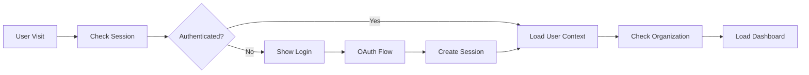

# Phase 1: Authentication Foundation

## Overview

Phase 1 establishes the authentication foundation for the PinPoint frontend rebuild. This phase is critical as it provides the security and user context required for all subsequent phases.

## Current State Analysis

### Authentication Backend Status ✅

- **NextAuth.js v5**: Fully configured with Google OAuth, Magic Link, and dev login
- **Session Management**: JWT sessions with organization context
- **Multi-tenant Support**: Organization lookup via subdomain
- **Permission System**: Role-based access control implemented
- **API Integration**: tRPC procedures with authentication middleware

### Current Frontend Limitations ❌

- **Mock Authentication**: Uses `useState` for login state
- **No Session Persistence**: State resets on page reload
- **No Organization Context**: Missing multi-tenant awareness
- **Mock Components**: `LoginModal` and `DevLoginCompact` are temporary
- **No Route Protection**: All routes accessible without authentication

## Goals

### Primary Goals

1. **Replace Mock Authentication**: Integrate real NextAuth.js session management
2. **Implement Session Persistence**: Maintain user state across page reloads
3. **Add Organization Context**: Connect to multi-tenant backend
4. **Create Authentication Guards**: Protect routes requiring authentication
5. **Build User Profile Components**: Display authenticated user information

### Secondary Goals

- Maintain current visual styling and theme
- Ensure mobile-responsive authentication flows
- Implement proper error handling for auth failures
- Add loading states for authentication operations

## Technical Architecture

### Authentication Flow



### Component Structure

```
src/app/
├── (auth)/                 # Authentication pages
│   ├── signin/
│   │   └── page.tsx       # Sign-in page
│   └── signup/
│       └── page.tsx       # Sign-up page
├── api/
│   └── auth/
│       └── [...nextauth]/ # NextAuth API routes
├── components/
│   ├── auth/
│   │   ├── AuthButton.tsx      # Sign in/out button
│   │   ├── AuthModal.tsx       # Authentication modal
│   │   ├── SignInForm.tsx      # Sign-in form
│   │   └── UserProfile.tsx     # User profile dropdown
│   └── providers/
│       └── AuthProvider.tsx    # Session provider
└── lib/
    ├── auth.ts            # NextAuth configuration
    └── session.ts         # Session utilities
```

## Implementation Plan

### Step 1: NextAuth Integration (Day 1)

**Tasks:**

- [ ] Update `src/app/api/auth/[...nextauth]/route.ts` with frontend configuration
- [ ] Create `AuthProvider` component wrapping the app
- [ ] Add session provider to root layout
- [ ] Test authentication flow with Google OAuth

**Files to Create/Update:**

- `src/components/providers/AuthProvider.tsx`
- `src/app/layout.tsx` (update to include session provider)
- `src/app/api/auth/[...nextauth]/route.ts` (ensure proper configuration)

### Step 2: Authentication Components (Day 2)

**Tasks:**

- [ ] Create `AuthButton` component replacing mock login
- [ ] Build `AuthModal` with Google OAuth integration
- [ ] Implement `UserProfile` dropdown for authenticated users
- [ ] Add sign-out functionality

**Files to Create:**

- `src/components/auth/AuthButton.tsx`
- `src/components/auth/AuthModal.tsx`
- `src/components/auth/UserProfile.tsx`
- `src/components/auth/SignInForm.tsx`

### Step 3: Session Management (Day 3)

**Tasks:**

- [ ] Create session utilities for client-side use
- [ ] Implement user context throughout the app
- [ ] Add session persistence and refresh
- [ ] Create loading states for session operations

**Files to Create:**

- `src/lib/session.ts`
- `src/hooks/useCurrentUser.ts`
- `src/hooks/useOrganization.ts`

### Step 4: Route Protection (Day 4)

**Tasks:**

- [ ] Create authentication middleware
- [ ] Implement route guards for protected pages
- [ ] Add redirect logic for unauthenticated users
- [ ] Test protected route access

**Files to Create:**

- `src/middleware.ts` (update existing)
- `src/lib/auth-guards.ts`
- `src/components/auth/ProtectedRoute.tsx`

### Step 5: Integration & Testing (Day 5)

**Tasks:**

- [ ] Replace mock components in `PrimaryAppBar`
- [ ] Update dashboard to use real user data
- [ ] Test authentication flow end-to-end
- [ ] Verify organization context is working

**Files to Update:**

- `src/components/PrimaryAppBar.tsx`
- `src/app/dashboard/page.tsx`
- All components using mock authentication

## Detailed Implementation

### AuthProvider Component

```typescript
// src/components/providers/AuthProvider.tsx
'use client';

import { SessionProvider } from 'next-auth/react';
import type { Session } from 'next-auth';

interface AuthProviderProps {
  children: React.ReactNode;
  session: Session | null;
}

export default function AuthProvider({ children, session }: AuthProviderProps) {
  return (
    <SessionProvider session={session}>
      {children}
    </SessionProvider>
  );
}
```

### AuthButton Component

```typescript
// src/components/auth/AuthButton.tsx
'use client';

import { Button } from '@mui/material';
import { signIn, signOut, useSession } from 'next-auth/react';
import { UserProfile } from './UserProfile';

export default function AuthButton() {
  const { data: session, status } = useSession();

  if (status === 'loading') {
    return <Button disabled>Loading...</Button>;
  }

  if (session) {
    return <UserProfile user={session.user} />;
  }

  return (
    <Button
      variant="contained"
      onClick={() => signIn()}
      sx={{
        bgcolor: '#667eea',
        '&:hover': { bgcolor: '#5a67d8' }
      }}
    >
      Sign In
    </Button>
  );
}
```

### User Context Hook

```typescript
// src/hooks/useCurrentUser.ts
"use client";

import { useSession } from "next-auth/react";
import { api } from "~/lib/api";

export function useCurrentUser() {
  const { data: session, status } = useSession();
  const { data: user, isLoading } = api.user.profile.useQuery(undefined, {
    enabled: !!session,
  });

  return {
    user,
    session,
    isLoading: status === "loading" || isLoading,
    isAuthenticated: !!session,
  };
}
```

### Route Protection Middleware

```typescript
// src/middleware.ts (update existing)
import { withAuth } from "next-auth/middleware";

export default withAuth(
  function middleware(req) {
    // Existing organization logic
    // Add authentication checks here
  },
  {
    callbacks: {
      authorized: ({ token, req }) => {
        // Check if user is authenticated for protected routes
        const protectedRoutes = ["/dashboard", "/issues", "/admin"];
        const isProtectedRoute = protectedRoutes.some((route) =>
          req.nextUrl.pathname.startsWith(route),
        );

        return !isProtectedRoute || !!token;
      },
    },
  },
);
```

## Integration Points

### With Current Components

1. **PrimaryAppBar**: Replace mock auth button with real `AuthButton`
2. **Dashboard**: Connect to real user data via `useCurrentUser`
3. **Layout**: Add session provider at root level
4. **Navigation**: Show/hide features based on authentication state

### With Backend APIs

1. **User Profile**: Connect to `user.profile` tRPC procedure
2. **Organization Context**: Use `organization.current` procedure
3. **Session Management**: Integrate with NextAuth session callbacks
4. **Permission Checks**: Use `auth.permissions` for role-based access

## Error Handling

### Authentication Errors

- **OAuth Failures**: Display user-friendly error messages
- **Session Expiry**: Automatic redirect to sign-in
- **Network Issues**: Retry logic with exponential backoff
- **Invalid Tokens**: Clear session and redirect to login

### User Experience

- **Loading States**: Show skeleton screens during auth checks
- **Error Messages**: Clear, actionable error messages
- **Fallback UI**: Graceful degradation for failed auth states
- **Accessibility**: Screen reader compatible error messages

## Testing Strategy

### Unit Tests

- [ ] AuthButton component behavior
- [ ] Session hook functionality
- [ ] Route protection logic
- [ ] Error handling scenarios

### Integration Tests

- [ ] OAuth flow end-to-end
- [ ] Session persistence across page reloads
- [ ] Protected route access
- [ ] Organization context loading

### E2E Tests

- [ ] Complete sign-in flow
- [ ] Sign-out functionality
- [ ] Session expiry handling
- [ ] Multi-tenant organization switching

## Success Criteria

### Functional Requirements

- [ ] Users can sign in with Google OAuth
- [ ] Sessions persist across page reloads
- [ ] Protected routes require authentication
- [ ] User profile displays correctly in app bar
- [ ] Organization context is available throughout app

### Technical Requirements

- [ ] No TypeScript errors
- [ ] All ESLint rules pass
- [ ] Mobile-responsive authentication
- [ ] Proper error handling implemented
- [ ] Loading states for all auth operations

### User Experience

- [ ] Smooth authentication flow
- [ ] Clear visual feedback for auth state
- [ ] Error messages are helpful and actionable
- [ ] Consistent with current visual design
- [ ] Accessible to screen readers

## Dependencies

### External Libraries

- `next-auth`: Authentication framework
- `@next-auth/prisma-adapter`: Database adapter
- `@mui/material`: UI components
- `@tanstack/react-query`: Data fetching (via tRPC)

### Backend APIs

- `auth.session`: Current user session
- `user.profile`: User profile data
- `organization.current`: Organization context
- `auth.permissions`: User permissions

## Risk Mitigation

### Technical Risks

- **Session Management**: Thorough testing of session persistence
- **OAuth Issues**: Fallback to magic link authentication
- **Performance**: Optimize auth checks and user lookups
- **Security**: Validate all authentication flows

### Timeline Risks

- **Complex Integration**: Start with simple auth flow first
- **Testing Time**: Parallel development of tests
- **Dependency Issues**: Have fallback authentication methods

## Future Enhancements

### Post-Phase 1

- **Social Logins**: Add Facebook, GitHub OAuth
- **Multi-factor Auth**: SMS and authenticator app support
- **Password Reset**: Self-service password management
- **Account Linking**: Connect multiple OAuth accounts

### Advanced Features

- **Single Sign-On**: Enterprise SSO integration
- **API Keys**: Developer API authentication
- **Audit Logging**: Track authentication events
- **Rate Limiting**: Prevent brute force attacks

## Conclusion

Phase 1 establishes the security foundation for the entire application. By implementing real authentication with NextAuth.js, session management, and route protection, we create a robust base for all subsequent development phases.

The focus on preserving the current visual design while adding real functionality ensures users get a seamless experience while the application gains the security and user context needed for advanced features.
