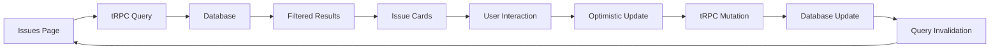

# Phase 2: Core Issue Management

## Overview

Phase 2 implements the core issue management functionality that forms the heart of the PinPoint application. This phase leverages the valuable patterns from the archived frontend, particularly the sophisticated issue page functionality, while connecting to the robust backend infrastructure.

## Current State Analysis

### Backend API Status ✅

- **Issue Management**: Complete tRPC routers for CRUD operations
  - `issue.core`: Create, read, update, delete issues
  - `issue.status`: Status management and transitions
  - `issue.timeline`: Activity tracking and history
  - `issue.comment`: Comment system with soft deletes
- **File Upload**: Image attachment system with Vercel Blob
- **Notification System**: Real-time updates for issue changes
- **Search & Filtering**: Advanced filtering by status, priority, assignee
- **Multi-tenant**: Organization-scoped queries with proper isolation

### Archived Frontend Patterns ✅

The archived frontend provides excellent patterns for:

- **Issue Detail Page**: Complete timeline with comments and activities
- **Issue Submission Form**: Machine selection, severity, image upload
- **Image Gallery**: Upload, display, and delete functionality
- **Real-time Updates**: Optimistic UI with tRPC invalidation
- **Filtering System**: Advanced search and filter capabilities

### Current Frontend Limitations ❌

- **No Issue Pages**: Current dashboard shows mock issue cards only
- **No Issue Creation**: No way to create new issues
- **No Issue Detail**: No detailed view of individual issues
- **No Real Data**: All issue data is hardcoded

## Goals

### Primary Goals

1. **Issues List Page**: Create `/issues` with filtering, sorting, and pagination
2. **Issue Detail Page**: Rebuild comprehensive issue view with timeline
3. **Issue Creation**: Implement issue submission form with machine selection
4. **Image Management**: Upload, display, and delete issue attachments
5. **Real-time Updates**: Optimistic UI with automatic data refresh

### Secondary Goals

- Maintain current visual styling and theme
- Implement advanced filtering and search
- Add proper loading states and error handling
- Ensure mobile-responsive design
- Add keyboard navigation support

## Technical Architecture

### Page Structure

```
src/app/
├── issues/
│   ├── page.tsx                    # Issues list page
│   ├── [id]/
│   │   └── page.tsx               # Issue detail page
│   ├── new/
│   │   └── page.tsx               # Create new issue
│   └── components/
│       ├── IssueCard.tsx          # Individual issue card
│       ├── IssueList.tsx          # Issues list with filtering
│       ├── IssueDetail.tsx        # Issue detail view
│       ├── IssueForm.tsx          # Issue creation/editing
│       ├── IssueTimeline.tsx      # Activity timeline
│       ├── IssueComments.tsx      # Comments section
│       ├── IssueImages.tsx        # Image gallery
│       └── IssueFilters.tsx       # Filtering controls
```

### Data Flow



## Implementation Plan

### Step 1: Issues List Page (Days 1-2)

**Tasks:**

- [ ] Create `/issues` page with layout
- [ ] Implement `IssueList` component with current card styling
- [ ] Add filtering controls (status, priority, assignee)
- [ ] Connect to `issue.core.list` tRPC procedure
- [ ] Add pagination and infinite scroll

**Files to Create:**

- `src/app/issues/page.tsx`
- `src/app/issues/components/IssueList.tsx`
- `src/app/issues/components/IssueCard.tsx`
- `src/app/issues/components/IssueFilters.tsx`
- `src/hooks/useIssues.ts`

### Step 2: Issue Detail Page (Days 3-4)

**Tasks:**

- [ ] Create `/issues/[id]` page structure
- [ ] Implement issue detail view with current styling
- [ ] Add issue timeline with activity history
- [ ] Build comments section with real-time updates
- [ ] Add edit functionality for issue properties

**Files to Create:**

- `src/app/issues/[id]/page.tsx`
- `src/app/issues/components/IssueDetail.tsx`
- `src/app/issues/components/IssueTimeline.tsx`
- `src/app/issues/components/IssueComments.tsx`
- `src/app/issues/components/IssueEditForm.tsx`

### Step 3: Issue Creation (Days 5-6)

**Tasks:**

- [ ] Create `/issues/new` page
- [ ] Implement issue submission form
- [ ] Add machine selection dropdown
- [ ] Implement image upload functionality
- [ ] Add form validation and error handling

**Files to Create:**

- `src/app/issues/new/page.tsx`
- `src/app/issues/components/IssueForm.tsx`
- `src/app/issues/components/MachineSelector.tsx`
- `src/app/issues/components/ImageUpload.tsx`

### Step 4: Image Management (Day 7)

**Tasks:**

- [ ] Implement image gallery component
- [ ] Add image upload with progress indicators
- [ ] Add image deletion functionality
- [ ] Implement image compression and optimization

**Files to Create:**

- `src/app/issues/components/IssueImages.tsx`
- `src/app/issues/components/ImageGallery.tsx`
- `src/lib/image-utils.ts`
- `src/hooks/useImageUpload.ts`

### Step 5: Real-time Updates (Days 8-9)

**Tasks:**

- [ ] Implement optimistic UI updates
- [ ] Add real-time comment updates
- [ ] Implement issue status change notifications
- [ ] Add loading states and error handling

**Files to Update:**

- All issue components with optimistic updates
- `src/hooks/useOptimisticIssue.ts`
- `src/lib/notifications.ts`

### Step 6: Integration & Polish (Day 10)

**Tasks:**

- [ ] Connect dashboard to real issue data
- [ ] Add keyboard navigation support
- [ ] Implement search functionality
- [ ] Add accessibility improvements
- [ ] Performance optimization

**Files to Update:**

- `src/app/dashboard/page.tsx`
- All issue components for accessibility
- Performance optimizations

## Detailed Implementation

### Issues List Page

```typescript
// src/app/issues/page.tsx
import { Suspense } from 'react';
import { Container, Box, Typography } from '@mui/material';
import { IssueList } from './components/IssueList';
import { IssueFilters } from './components/IssueFilters';
import { CreateIssueButton } from './components/CreateIssueButton';

export default function IssuesPage() {
  return (
    <Container maxWidth="lg" sx={{ py: 4 }}>
      <Box display="flex" justifyContent="space-between" alignItems="center" mb={4}>
        <Typography variant="h4" component="h1">
          Issues
        </Typography>
        <CreateIssueButton />
      </Box>

      <IssueFilters />

      <Suspense fallback={<IssueListSkeleton />}>
        <IssueList />
      </Suspense>
    </Container>
  );
}
```

### Issue List Component

```typescript
// src/app/issues/components/IssueList.tsx
'use client';

import { Grid, Alert, CircularProgress, Box } from '@mui/material';
import { api } from '~/lib/api';
import { useIssueFilters } from '~/hooks/useIssueFilters';
import { IssueCard } from './IssueCard';
import { IssueListSkeleton } from './IssueListSkeleton';

export function IssueList() {
  const { filters, sorting } = useIssueFilters();

  const { data: issues, isLoading, error } = api.issue.core.list.useQuery({
    filters,
    sorting,
    pagination: { limit: 20 }
  });

  if (isLoading) return <IssueListSkeleton />;
  if (error) return <Alert severity="error">Failed to load issues</Alert>;
  if (!issues?.length) return <Alert severity="info">No issues found</Alert>;

  return (
    <Grid container spacing={3}>
      {issues.map((issue) => (
        <Grid item xs={12} md={6} lg={4} key={issue.id}>
          <IssueCard issue={issue} />
        </Grid>
      ))}
    </Grid>
  );
}
```

### Issue Detail Page

```typescript
// src/app/issues/[id]/page.tsx
import { notFound } from 'next/navigation';
import { Container, Box, Breadcrumbs, Link, Typography } from '@mui/material';
import { api } from '~/lib/api';
import { IssueDetail } from '../components/IssueDetail';

interface IssueDetailPageProps {
  params: { id: string };
}

export default async function IssueDetailPage({ params }: IssueDetailPageProps) {
  const issue = await api.issue.core.byId.query({ id: params.id });

  if (!issue) {
    notFound();
  }

  return (
    <Container maxWidth="lg" sx={{ py: 4 }}>
      <Breadcrumbs mb={4}>
        <Link href="/dashboard">Dashboard</Link>
        <Link href="/issues">Issues</Link>
        <Typography color="text.primary">Issue #{issue.id.slice(0, 8)}</Typography>
      </Breadcrumbs>

      <IssueDetail issue={issue} />
    </Container>
  );
}
```

### Issue Form Component

```typescript
// src/app/issues/components/IssueForm.tsx
'use client';

import { useState } from 'react';
import { useRouter } from 'next/navigation';
import {
  Card,
  CardContent,
  TextField,
  Select,
  MenuItem,
  Button,
  Box,
  Typography,
  Alert
} from '@mui/material';
import { api } from '~/lib/api';
import { MachineSelector } from './MachineSelector';
import { ImageUpload } from './ImageUpload';
import { useForm } from 'react-hook-form';
import { zodResolver } from '@hookform/resolvers/zod';
import { issueCreateSchema } from '~/server/api/schemas';

export function IssueForm() {
  const router = useRouter();
  const [images, setImages] = useState<File[]>([]);

  const { register, handleSubmit, formState: { errors } } = useForm({
    resolver: zodResolver(issueCreateSchema)
  });

  const createIssue = api.issue.core.create.useMutation({
    onSuccess: (issue) => {
      router.push(`/issues/${issue.id}`);
    }
  });

  const onSubmit = async (data: any) => {
    await createIssue.mutateAsync({
      ...data,
      images: images.map(file => ({ file }))
    });
  };

  return (
    <Card>
      <CardContent>
        <Typography variant="h6" gutterBottom>
          Report an Issue
        </Typography>

        <Box component="form" onSubmit={handleSubmit(onSubmit)} noValidate>
          <MachineSelector
            {...register('machineId')}
            error={!!errors.machineId}
            helperText={errors.machineId?.message}
          />

          <TextField
            {...register('title')}
            label="Issue Title"
            fullWidth
            required
            margin="normal"
            error={!!errors.title}
            helperText={errors.title?.message}
          />

          <TextField
            {...register('description')}
            label="Description"
            fullWidth
            multiline
            rows={4}
            margin="normal"
            error={!!errors.description}
            helperText={errors.description?.message}
          />

          <Select
            {...register('priority')}
            label="Priority"
            fullWidth
            margin="normal"
          >
            <MenuItem value="LOW">Low</MenuItem>
            <MenuItem value="MEDIUM">Medium</MenuItem>
            <MenuItem value="HIGH">High</MenuItem>
            <MenuItem value="CRITICAL">Critical</MenuItem>
          </Select>

          <ImageUpload
            images={images}
            onChange={setImages}
            maxImages={3}
          />

          {createIssue.error && (
            <Alert severity="error" sx={{ mt: 2 }}>
              {createIssue.error.message}
            </Alert>
          )}

          <Box sx={{ mt: 3, display: 'flex', gap: 2 }}>
            <Button
              type="submit"
              variant="contained"
              disabled={createIssue.isPending}
              sx={{ bgcolor: '#667eea' }}
            >
              {createIssue.isPending ? 'Creating...' : 'Create Issue'}
            </Button>
            <Button
              variant="outlined"
              onClick={() => router.back()}
            >
              Cancel
            </Button>
          </Box>
        </Box>
      </CardContent>
    </Card>
  );
}
```

### Real-time Updates Hook

```typescript
// src/hooks/useOptimisticIssue.ts
import { api } from "~/lib/api";
import { useOptimistic } from "react";

export function useOptimisticIssue(issueId: string) {
  const utils = api.useUtils();
  const { data: issue } = api.issue.core.byId.useQuery({ id: issueId });

  const [optimisticIssue, addOptimisticUpdate] = useOptimistic(
    issue,
    (state, newIssue) => ({ ...state, ...newIssue }),
  );

  const updateStatus = api.issue.core.updateStatus.useMutation({
    onMutate: async (newStatus) => {
      await utils.issue.core.byId.cancel({ id: issueId });
      addOptimisticUpdate({ statusId: newStatus.statusId });
    },
    onError: (err, newStatus, context) => {
      utils.issue.core.byId.setData({ id: issueId }, context?.previousIssue);
    },
    onSettled: () => {
      utils.issue.core.byId.invalidate({ id: issueId });
    },
  });

  const addComment = api.issue.comment.create.useMutation({
    onMutate: async (newComment) => {
      await utils.issue.core.byId.cancel({ id: issueId });
      addOptimisticUpdate({
        comments: [...(issue?.comments || []), newComment],
      });
    },
    onError: (err, newComment, context) => {
      utils.issue.core.byId.setData({ id: issueId }, context?.previousIssue);
    },
    onSettled: () => {
      utils.issue.core.byId.invalidate({ id: issueId });
    },
  });

  return {
    issue: optimisticIssue,
    updateStatus,
    addComment,
  };
}
```

## Integration Points

### With Authentication (Phase 1)

- **User Context**: Display user's assigned issues and permissions
- **Role-based Access**: Show/hide features based on user permissions
- **Organization Context**: Scope all issues to current organization

### With Dashboard

- **Issue Cards**: Replace mock cards with real data from issues list
- **Navigation**: Link dashboard issue cards to issue detail pages
- **Statistics**: Show real issue counts and status distribution

### With Backend APIs

- **Issue CRUD**: Full integration with issue management APIs
- **File Upload**: Connect to upload API for image attachments
- **Notifications**: Real-time updates for issue changes
- **Search**: Advanced filtering and search capabilities

## Error Handling

### User Experience

- **Loading States**: Skeleton screens for all loading operations
- **Error Messages**: Clear, actionable error messages
- **Retry Logic**: Automatic retry for failed requests
- **Offline Support**: Graceful handling of network issues

### Technical Handling

- **API Errors**: Proper error boundaries and fallbacks
- **Validation**: Client-side form validation with server-side backup
- **File Upload**: Progress indicators and error handling
- **Optimistic Updates**: Rollback on failure

## Performance Optimization

### Data Loading

- **Pagination**: Infinite scroll for large issue lists
- **Caching**: Intelligent caching with React Query
- **Prefetching**: Pre-load related data
- **Debouncing**: Debounced search and filtering

### Image Handling

- **Compression**: Client-side image compression
- **Lazy Loading**: Load images on demand
- **Thumbnails**: Generate thumbnails for galleries
- **CDN**: Serve images from Vercel Blob

## Testing Strategy

### Unit Tests

- [ ] Issue list rendering and filtering
- [ ] Issue form validation and submission
- [ ] Image upload functionality
- [ ] Optimistic updates behavior

### Integration Tests

- [ ] End-to-end issue creation flow
- [ ] Real-time updates and notifications
- [ ] File upload and image management
- [ ] Navigation between pages

### E2E Tests

- [ ] Complete issue management workflow
- [ ] Cross-browser compatibility
- [ ] Mobile responsiveness
- [ ] Accessibility compliance

## Success Criteria

### Functional Requirements

- [ ] Users can view all issues with filtering/sorting
- [ ] Users can create new issues with images
- [ ] Users can view detailed issue information
- [ ] Users can comment on issues
- [ ] Users can update issue status and properties
- [ ] Real-time updates work correctly

### Technical Requirements

- [ ] No TypeScript errors
- [ ] All ESLint rules pass
- [ ] Mobile-responsive design
- [ ] Accessibility compliant (WCAG 2.1)
- [ ] Performance optimized (Lighthouse > 90)

### User Experience

- [ ] Smooth, intuitive interface
- [ ] Clear visual feedback for all actions
- [ ] Helpful error messages
- [ ] Consistent with current visual design
- [ ] Fast loading times

## Dependencies

### External Libraries

- `@mui/material`: UI components
- `@hookform/resolvers`: Form validation
- `react-hook-form`: Form management
- `zod`: Schema validation
- `@tanstack/react-query`: Data fetching

### Internal Dependencies

- Phase 1 authentication must be complete
- Backend tRPC APIs must be functional
- Image upload system must be configured

## Risk Mitigation

### Technical Risks

- **Complex State Management**: Use proven patterns from archived frontend
- **Performance Issues**: Implement pagination and lazy loading
- **File Upload**: Robust error handling and progress indicators
- **Real-time Updates**: Fallback to polling if WebSocket fails

### Timeline Risks

- **Scope Creep**: Focus on core functionality first
- **Integration Issues**: Early integration with backend APIs
- **Testing Time**: Parallel development of tests

## Future Enhancements

### Phase 2 Extensions

- **Advanced Search**: Full-text search across all issue fields
- **Bulk Operations**: Multi-select for batch operations
- **Issue Templates**: Pre-defined issue templates
- **Webhooks**: Integration with external systems

### V2.0 Features

- **Kanban Board**: Drag-and-drop issue management
- **Advanced Filtering**: Custom filter builder
- **Analytics**: Issue reporting and analytics
- **Automation**: Automated issue assignment and routing

## Conclusion

Phase 2 delivers the core value proposition of PinPoint by implementing comprehensive issue management functionality. By leveraging the proven patterns from the archived frontend while connecting to the robust backend infrastructure, this phase creates a solid foundation for advanced features while maintaining the appealing visual design that users appreciate.

The focus on real-time updates, optimistic UI, and mobile responsiveness ensures that users have a modern, efficient experience when managing their pinball machine issues.
