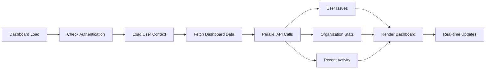

# Phase 3: Dashboard Enhancement

## Overview

Phase 3 enhances the existing dashboard by replacing mock data with real backend integration, making navigation functional, and adding proper loading states and error handling. This phase builds upon the authentication foundation from Phase 1 and the issue management system from Phase 2.

## Current State Analysis

### Dashboard Strengths to Preserve ✅

- **Visual Design**: Excellent dark theme with purple/blue accents
- **Card Layout**: Clean, modern card-based layout with hover effects
- **Priority Indicators**: Colored left borders for issue priority
- **Responsive Grid**: Proper MUI Grid v7 implementation
- **App Bar**: Clean navigation structure with organization logo

### Current Limitations ❌

- **Mock Data**: All dashboard data is hardcoded
- **Non-functional Navigation**: Navigation buttons don't work
- **No Loading States**: No feedback during data loading
- **No Error Handling**: No fallback for failed API calls
- **No Real Statistics**: Counts and metrics are fake

### Backend Integration Ready ✅

- **Issue APIs**: Complete issue management system
- **User APIs**: User profile and assignment data
- **Organization APIs**: Organization context and statistics
- **Machine APIs**: Machine status and counts
- **Real-time Updates**: Notification system for live data

## Goals

### Primary Goals

1. **Connect to Real Data**: Replace all mock data with tRPC API calls
2. **Functional Navigation**: Make all navigation buttons and links work
3. **Loading States**: Add skeleton screens and progress indicators
4. **Error Handling**: Implement user-friendly error messages and retry logic
5. **Real Statistics**: Display actual issue counts and user metrics

### Secondary Goals

- Maintain exact visual styling and layout
- Add real-time updates for dynamic data
- Implement proper accessibility features
- Add keyboard navigation support
- Optimize performance with proper caching

## Technical Architecture

### Data Flow



### Component Structure

```
src/app/dashboard/
├── page.tsx                    # Main dashboard page
├── components/
│   ├── DashboardGrid.tsx      # Main dashboard layout
│   ├── IssueStatsCard.tsx     # Issue statistics card
│   ├── AssignedIssuesCard.tsx # User's assigned issues
│   ├── RecentActivityCard.tsx # Recent activity feed
│   ├── QuickActionsCard.tsx   # Quick action buttons
│   └── DashboardSkeleton.tsx  # Loading state
├── hooks/
│   ├── useDashboardData.ts    # Dashboard data fetching
│   └── useRealTimeUpdates.ts  # Real-time update handling
└── utils/
    └── dashboard-utils.ts      # Utility functions
```

## Implementation Plan

### Step 1: Data Integration Setup (Day 1)

**Tasks:**

- [ ] Create dashboard data hooks
- [ ] Set up tRPC queries for dashboard data
- [ ] Implement error handling utilities
- [ ] Create loading state components

**Files to Create:**

- `src/app/dashboard/hooks/useDashboardData.ts`
- `src/app/dashboard/components/DashboardSkeleton.tsx`
- `src/app/dashboard/components/ErrorBoundary.tsx`
- `src/lib/dashboard-queries.ts`

### Step 2: Issue Statistics Integration (Day 2)

**Tasks:**

- [ ] Connect issue statistics to real API
- [ ] Implement user's assigned issues display
- [ ] Add filtering and sorting for issue lists
- [ ] Create issue status distribution charts

**Files to Update:**

- `src/app/dashboard/components/IssueStatsCard.tsx`
- `src/app/dashboard/components/AssignedIssuesCard.tsx`
- `src/app/dashboard/components/DetailedIssueCard.tsx`

### Step 3: Navigation Enhancement (Day 3)

**Tasks:**

- [ ] Make all navigation buttons functional
- [ ] Implement proper routing to issues pages
- [ ] Add breadcrumb navigation
- [ ] Create keyboard navigation support

**Files to Update:**

- `src/components/PrimaryAppBar.tsx`
- `src/app/dashboard/components/QuickActionsCard.tsx`
- `src/app/dashboard/components/NavigationButtons.tsx`

### Step 4: Real-time Updates (Day 4)

**Tasks:**

- [ ] Implement real-time issue updates
- [ ] Add notification system integration
- [ ] Create activity feed with live updates
- [ ] Add optimistic updates for user actions

**Files to Create:**

- `src/app/dashboard/hooks/useRealTimeUpdates.ts`
- `src/app/dashboard/components/RecentActivityCard.tsx`
- `src/app/dashboard/components/NotificationBadge.tsx`

### Step 5: Performance & Polish (Day 5)

**Tasks:**

- [ ] Optimize API calls with proper caching
- [ ] Add accessibility improvements
- [ ] Implement error retry mechanisms
- [ ] Add performance monitoring

**Files to Update:**

- All dashboard components for performance
- `src/app/dashboard/page.tsx`
- `src/lib/performance-utils.ts`

## Detailed Implementation

### Dashboard Data Hook

```typescript
// src/app/dashboard/hooks/useDashboardData.ts
import { api } from "~/lib/api";
import { useCurrentUser } from "~/hooks/useCurrentUser";

export function useDashboardData() {
  const { user } = useCurrentUser();

  const { data: userStats, isLoading: userStatsLoading } =
    api.user.stats.useQuery(undefined, { enabled: !!user });

  const { data: assignedIssues, isLoading: assignedIssuesLoading } =
    api.issue.core.assigned.useQuery({ userId: user?.id }, { enabled: !!user });

  const { data: organizationStats, isLoading: orgStatsLoading } =
    api.organization.stats.useQuery();

  const { data: recentActivity, isLoading: activityLoading } =
    api.issue.timeline.recent.useQuery({ limit: 10 });

  return {
    userStats,
    assignedIssues,
    organizationStats,
    recentActivity,
    isLoading:
      userStatsLoading ||
      assignedIssuesLoading ||
      orgStatsLoading ||
      activityLoading,
    error: null, // Add proper error handling
  };
}
```

### Enhanced Dashboard Page

```typescript
// src/app/dashboard/page.tsx
import { Suspense } from 'react';
import { Container, Grid, Box, Typography, Alert } from '@mui/material';
import { PrimaryAppBar } from '~/components/PrimaryAppBar';
import { DashboardGrid } from './components/DashboardGrid';
import { DashboardSkeleton } from './components/DashboardSkeleton';
import { ErrorBoundary } from './components/ErrorBoundary';
import { useDashboardData } from './hooks/useDashboardData';

function DashboardContent() {
  const {
    userStats,
    assignedIssues,
    organizationStats,
    recentActivity,
    isLoading,
    error
  } = useDashboardData();

  if (isLoading) return <DashboardSkeleton />;
  if (error) return <Alert severity="error">Failed to load dashboard data</Alert>;

  return (
    <Container maxWidth="lg" sx={{ py: 4 }}>
      <Typography variant="h4" component="h1" gutterBottom>
        Dashboard
      </Typography>

      <DashboardGrid
        userStats={userStats}
        assignedIssues={assignedIssues}
        organizationStats={organizationStats}
        recentActivity={recentActivity}
      />
    </Container>
  );
}

export default function DashboardPage() {
  return (
    <ErrorBoundary>
      <Suspense fallback={<DashboardSkeleton />}>
        <DashboardContent />
      </Suspense>
    </ErrorBoundary>
  );
}
```

### Enhanced Issue Statistics Card

```typescript
// src/app/dashboard/components/IssueStatsCard.tsx
'use client';

import { Card, CardContent, Typography, Box, Chip } from '@mui/material';
import { useRouter } from 'next/navigation';
import { IssueStatus } from '@prisma/client';

interface IssueStatsCardProps {
  stats: {
    total: number;
    byStatus: Record<IssueStatus, number>;
    byPriority: Record<string, number>;
  };
}

export function IssueStatsCard({ stats }: IssueStatsCardProps) {
  const router = useRouter();

  const handleStatusClick = (status: IssueStatus) => {
    router.push(`/issues?status=${status}`);
  };

  return (
    <Card
      sx={{
        bgcolor: '#2d3748',
        color: 'white',
        '&:hover': { bgcolor: '#4a5568' },
        cursor: 'pointer'
      }}
      onClick={() => router.push('/issues')}
    >
      <CardContent>
        <Typography variant="h6" gutterBottom>
          Issues Overview
        </Typography>

        <Typography variant="h3" component="div" sx={{ mb: 2 }}>
          {stats.total}
        </Typography>

        <Box sx={{ display: 'flex', flexWrap: 'wrap', gap: 1 }}>
          {Object.entries(stats.byStatus).map(([status, count]) => (
            <Chip
              key={status}
              label={`${status}: ${count}`}
              variant="outlined"
              size="small"
              onClick={(e) => {
                e.stopPropagation();
                handleStatusClick(status as IssueStatus);
              }}
              sx={{
                color: 'white',
                borderColor: 'rgba(255, 255, 255, 0.3)',
                '&:hover': { borderColor: '#667eea' }
              }}
            />
          ))}
        </Box>
      </CardContent>
    </Card>
  );
}
```

### Assigned Issues Card

```typescript
// src/app/dashboard/components/AssignedIssuesCard.tsx
'use client';

import { Card, CardContent, Typography, Box, Avatar, Chip } from '@mui/material';
import { useRouter } from 'next/navigation';
import { Issue, Machine, IssueStatus } from '@prisma/client';

interface AssignedIssuesCardProps {
  issues: Array<Issue & { machine: Machine }>;
}

export function AssignedIssuesCard({ issues }: AssignedIssuesCardProps) {
  const router = useRouter();

  const getPriorityColor = (priority: string) => {
    switch (priority) {
      case 'CRITICAL': return '#f56565';
      case 'HIGH': return '#ed8936';
      case 'MEDIUM': return '#667eea';
      default: return '#48bb78';
    }
  };

  const getStatusColor = (status: IssueStatus) => {
    switch (status) {
      case 'NEW': return '#667eea';
      case 'IN_PROGRESS': return '#ed8936';
      case 'RESOLVED': return '#48bb78';
      default: return '#a0aec0';
    }
  };

  return (
    <Card sx={{ bgcolor: '#2d3748', color: 'white' }}>
      <CardContent>
        <Typography variant="h6" gutterBottom>
          Assigned to Me ({issues.length})
        </Typography>

        <Box sx={{ maxHeight: 400, overflowY: 'auto' }}>
          {issues.length === 0 ? (
            <Typography variant="body2" color="text.secondary">
              No issues assigned to you
            </Typography>
          ) : (
            issues.map((issue) => (
              <Box
                key={issue.id}
                sx={{
                  display: 'flex',
                  alignItems: 'center',
                  p: 2,
                  mb: 1,
                  borderRadius: 1,
                  bgcolor: 'rgba(255, 255, 255, 0.05)',
                  borderLeft: `4px solid ${getPriorityColor(issue.priority)}`,
                  cursor: 'pointer',
                  '&:hover': { bgcolor: 'rgba(255, 255, 255, 0.1)' }
                }}
                onClick={() => router.push(`/issues/${issue.id}`)}
              >
                <Avatar sx={{ mr: 2, bgcolor: getPriorityColor(issue.priority) }}>
                  {issue.priority.charAt(0)}
                </Avatar>

                <Box sx={{ flexGrow: 1 }}>
                  <Typography variant="subtitle2" noWrap>
                    {issue.title}
                  </Typography>
                  <Typography variant="body2" color="text.secondary" noWrap>
                    {issue.machine.name}
                  </Typography>
                </Box>

                <Chip
                  label={issue.status}
                  size="small"
                  sx={{
                    bgcolor: getStatusColor(issue.status),
                    color: 'white',
                    fontWeight: 'bold'
                  }}
                />
              </Box>
            ))
          )}
        </Box>
      </CardContent>
    </Card>
  );
}
```

### Real-time Updates Hook

```typescript
// src/app/dashboard/hooks/useRealTimeUpdates.ts
import { useEffect } from "react";
import { api } from "~/lib/api";
import { useCurrentUser } from "~/hooks/useCurrentUser";

export function useRealTimeUpdates() {
  const { user } = useCurrentUser();
  const utils = api.useUtils();

  useEffect(() => {
    if (!user) return;

    // Poll for updates every 30 seconds
    const interval = setInterval(() => {
      utils.user.stats.invalidate();
      utils.issue.core.assigned.invalidate();
      utils.organization.stats.invalidate();
      utils.issue.timeline.recent.invalidate();
    }, 30000);

    return () => clearInterval(interval);
  }, [user, utils]);

  // Listen for real-time events (WebSocket integration)
  useEffect(() => {
    const handleIssueUpdate = (event: CustomEvent) => {
      utils.issue.core.assigned.invalidate();
      utils.organization.stats.invalidate();
    };

    const handleCommentUpdate = (event: CustomEvent) => {
      utils.issue.timeline.recent.invalidate();
    };

    window.addEventListener("issue-updated", handleIssueUpdate);
    window.addEventListener("comment-added", handleCommentUpdate);

    return () => {
      window.removeEventListener("issue-updated", handleIssueUpdate);
      window.removeEventListener("comment-added", handleCommentUpdate);
    };
  }, [utils]);
}
```

### Dashboard Skeleton

```typescript
// src/app/dashboard/components/DashboardSkeleton.tsx
import { Grid, Card, CardContent, Skeleton, Container, Box } from '@mui/material';

export function DashboardSkeleton() {
  return (
    <Container maxWidth="lg" sx={{ py: 4 }}>
      <Skeleton variant="text" width={200} height={40} sx={{ mb: 4 }} />

      <Grid container spacing={3}>
        {/* Stats Cards */}
        {[...Array(3)].map((_, index) => (
          <Grid item xs={12} md={4} key={index}>
            <Card sx={{ bgcolor: '#2d3748' }}>
              <CardContent>
                <Skeleton variant="text" width="60%" height={24} />
                <Skeleton variant="text" width="40%" height={48} sx={{ my: 2 }} />
                <Box sx={{ display: 'flex', gap: 1 }}>
                  <Skeleton variant="rounded" width={60} height={24} />
                  <Skeleton variant="rounded" width={60} height={24} />
                  <Skeleton variant="rounded" width={60} height={24} />
                </Box>
              </CardContent>
            </Card>
          </Grid>
        ))}

        {/* Assigned Issues */}
        <Grid item xs={12} md={8}>
          <Card sx={{ bgcolor: '#2d3748' }}>
            <CardContent>
              <Skeleton variant="text" width="40%" height={24} sx={{ mb: 2 }} />
              {[...Array(5)].map((_, index) => (
                <Box key={index} sx={{ display: 'flex', alignItems: 'center', mb: 2 }}>
                  <Skeleton variant="circular" width={40} height={40} sx={{ mr: 2 }} />
                  <Box sx={{ flexGrow: 1 }}>
                    <Skeleton variant="text" width="70%" height={20} />
                    <Skeleton variant="text" width="50%" height={16} />
                  </Box>
                  <Skeleton variant="rounded" width={80} height={24} />
                </Box>
              ))}
            </CardContent>
          </Card>
        </Grid>

        {/* Recent Activity */}
        <Grid item xs={12} md={4}>
          <Card sx={{ bgcolor: '#2d3748' }}>
            <CardContent>
              <Skeleton variant="text" width="60%" height={24} sx={{ mb: 2 }} />
              {[...Array(8)].map((_, index) => (
                <Box key={index} sx={{ mb: 2 }}>
                  <Skeleton variant="text" width="90%" height={16} />
                  <Skeleton variant="text" width="60%" height={14} />
                </Box>
              ))}
            </CardContent>
          </Card>
        </Grid>
      </Grid>
    </Container>
  );
}
```

## Integration Points

### With Authentication (Phase 1)

- **User Context**: Display user-specific dashboard data
- **Session Management**: Handle session expiry gracefully
- **Organization Context**: Show organization-scoped statistics

### With Issue Management (Phase 2)

- **Issue Navigation**: Link dashboard cards to issue pages
- **Real-time Updates**: Reflect changes from issue management
- **Filtering**: Pre-filter issues based on dashboard interactions

### With Backend APIs

- **Dashboard Data**: Connect to user, organization, and issue APIs
- **Real-time Updates**: Integrate with notification system
- **Performance**: Optimize API calls with proper caching

## Error Handling

### User Experience

- **Loading States**: Skeleton screens during data loading
- **Error Messages**: User-friendly error messages with retry options
- **Offline Support**: Graceful degradation when offline
- **Partial Failures**: Handle partial API failures gracefully

### Technical Implementation

- **Error Boundaries**: Catch and handle component errors
- **Retry Logic**: Automatic retry with exponential backoff
- **Fallback Data**: Show cached data when APIs fail
- **Logging**: Track errors for debugging and monitoring

## Performance Optimization

### Data Loading

- **Parallel Requests**: Load dashboard data in parallel
- **Caching**: Intelligent caching with React Query
- **Pagination**: Limit initial data load
- **Prefetching**: Pre-load related data

### UI Performance

- **Memoization**: Prevent unnecessary re-renders
- **Virtual Scrolling**: Handle large lists efficiently
- **Lazy Loading**: Load components on demand
- **Bundle Optimization**: Code splitting for better loading

## Testing Strategy

### Unit Tests

- [ ] Dashboard data hooks
- [ ] Component rendering with different data states
- [ ] Navigation functionality
- [ ] Error handling scenarios

### Integration Tests

- [ ] API integration with real backend
- [ ] Real-time updates functionality
- [ ] Navigation flow between pages
- [ ] Error recovery mechanisms

### E2E Tests

- [ ] Complete dashboard workflow
- [ ] Cross-browser compatibility
- [ ] Mobile responsiveness
- [ ] Performance benchmarks

## Success Criteria

### Functional Requirements

- [ ] Dashboard shows real user and organization data
- [ ] All navigation buttons work correctly
- [ ] Loading states provide good user experience
- [ ] Error handling is comprehensive and user-friendly
- [ ] Real-time updates work correctly

### Technical Requirements

- [ ] No TypeScript errors
- [ ] All ESLint rules pass
- [ ] Mobile-responsive design maintained
- [ ] Accessibility compliant (WCAG 2.1)
- [ ] Performance optimized (Lighthouse > 90)

### User Experience

- [ ] Smooth, intuitive interface
- [ ] Visual design exactly preserved
- [ ] Fast loading times
- [ ] Clear feedback for all actions
- [ ] Keyboard navigation support

## Dependencies

### External Libraries

- `@mui/material`: UI components
- `@tanstack/react-query`: Data fetching and caching
- `next/navigation`: Client-side routing

### Internal Dependencies

- Phase 1 authentication system
- Phase 2 issue management (for navigation)
- Backend tRPC APIs for dashboard data

## Risk Mitigation

### Technical Risks

- **API Performance**: Optimize queries and implement caching
- **Data Consistency**: Handle race conditions and stale data
- **Mobile Experience**: Thorough testing on mobile devices
- **Browser Compatibility**: Test across all major browsers

### Timeline Risks

- **Complex Integration**: Start with simple data connections
- **Performance Issues**: Monitor and optimize throughout development
- **Testing Time**: Automated testing for regression prevention

## Future Enhancements

### Post-Phase 3

- **Advanced Analytics**: Charts and graphs for issue trends
- **Customizable Dashboard**: User-configurable widgets
- **Export Functionality**: Export dashboard data as reports
- **Notifications**: In-app notification system

### V2.0 Features

- **Real-time Collaboration**: Live updates with WebSockets
- **Advanced Filtering**: Complex filter builder
- **Bulk Operations**: Multi-select actions from dashboard
- **Mobile App**: Native mobile dashboard experience

## Conclusion

Phase 3 transforms the existing visually appealing dashboard into a fully functional, data-driven interface that provides real value to users. By connecting to the robust backend infrastructure while preserving the excellent visual design, this phase creates a solid foundation for advanced features while delivering immediate improvements to the user experience.

The focus on real-time updates, performance optimization, and comprehensive error handling ensures that users have a reliable, efficient tool for managing their pinball machine issues and understanding their organization's operational status.
