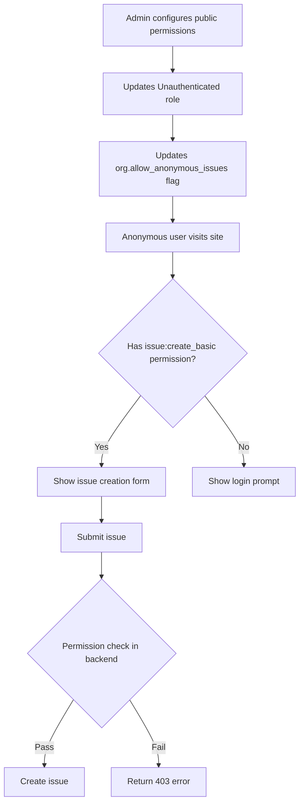

# Admin Console - Alpha/Beta MVP Feature Specification

**Status**: 🚧 In Development
**Target Release**: Alpha/Beta
**Created**: 2025-01-08
**Last Updated**: 2025-01-08
**Owner**: Engineering Team

---

## Executive Summary

This specification defines the **minimum viable admin functionality** required for Alpha/Beta release. The scope is intentionally limited to support basic user management and configurable public permissions, with all advanced features deferred to V1.0.

**Alpha Scope:**
- ✅ Pre-created roles (Admin, Member, Unauthenticated) - no role CRUD
- ✅ Complete user management (invite, assign roles, remove)
- ✅ Public permission configuration (unauthenticated role settings)
- ✅ Integration with anonymous issue creation (separate branch)

**Deferred to V1.0:**
- ❌ Role creation/editing/deletion UI
- ❌ Custom role templates
- ❌ Bulk user operations
- ❌ Advanced activity log filtering
- ❌ Security dashboard
- ❌ Session management

---

## Goals & Non-Goals

### Goals

1. **Enable basic organization administration** for single-org Beta deployment
2. **Support user onboarding** through invitation system with email notifications
3. **Control public access** to organization resources via permission configuration
4. **Maintain security** with proper permission checks and validation
5. **Integrate seamlessly** with anonymous issue creation feature

### Non-Goals

1. Multi-organization user management (V1.0)
2. Custom role creation or modification (V1.0)
3. Advanced analytics or reporting (V1.0+)
4. Bulk administrative operations (V1.0)
5. Real-time notifications or webhooks (V2.0+)

---

## User Personas

### Primary: Organization Administrator
- **Name**: Sarah (Arcade Operator Admin)
- **Technical Level**: Non-technical
- **Goals**: Invite technicians, control who can report issues publicly
- **Pain Points**: Needs simple, clear interface without complexity

### Secondary: System Owner
- **Name**: Tim (Developer/Operator)
- **Technical Level**: High
- **Goals**: Configure system for Beta testing, manage permissions
- **Pain Points**: Needs to ensure proper access control before public launch

---

## Architecture Context

### Existing Infrastructure (Already Complete)

```typescript
// Database Schema
organizations {
  allow_anonymous_issues: boolean
  allow_anonymous_comments: boolean
  is_public: boolean
}

roles {
  id, name, organization_id
  is_system: boolean (Admin, Unauthenticated)
  is_default: boolean (Member)
}

permissions {
  id, name, description
  // 14 permissions defined in constants
}

memberships {
  user_id, organization_id, role_id
}

invitations {
  email, role_id, token, expires_at, status
}
```

### Backend APIs (Existing - Complete)

```typescript
// admin.ts router
admin.getUsers()          // ✅ List organization members
admin.updateUserRole()    // ✅ Change user's role
admin.inviteUser()        // ✅ Create invitation (missing email)
admin.getInvitations()    // ✅ List pending invitations
admin.removeUser()        // ✅ Remove member
admin.cancelInvitation()  // ✅ Cancel pending invitation

// role.ts router
role.getAll()             // ✅ List all roles
role.getPermissions()     // ✅ Get all available permissions
role.update()             // ✅ Update role (will use for Unauthenticated)

// Permission system
PermissionService         // ✅ Full permission checking
PERMISSIONS constants     // ✅ All 14 permissions defined
```

### Frontend Components (Existing - Partial)

```typescript
// Pages
/settings                 // ✅ Overview dashboard
/settings/users           // ✅ User list (needs enhancements)
/settings/organization    // ✅ Org settings (needs public perms)

// Components
<InviteUserDialog>        // ✅ Exists, works
<RoleChangeDialog>        // ✅ Exists, works
<UserTableActions>        // ⚠️ Has hardcoded permission check
```

---

## Feature 1: Email Invitation System

### Priority: 🔴 CRITICAL

### Current State
- Backend creates user + membership records ✅
- No email sent to invitee ❌
- No invitation acceptance flow ❌
- No token validation ❌

### Requirements

#### FR-1.1: Email Service Integration
**Must Have:**
- Integrate email service provider (Resend recommended)
- Configure SMTP credentials via environment variables
- Handle email sending failures gracefully
- Log email sending attempts to activity log

**Environment Variables:**
```bash
RESEND_API_KEY=re_xxxxx
INVITATION_FROM_EMAIL=noreply@pinpoint.app
INVITATION_FROM_NAME=PinPoint
BASE_URL=https://pinpoint.app  # For link generation
```

#### FR-1.2: Invitation Email Template
**Must Have:**
- Professional HTML email template
- Contains invitation details:
  - Organization name
  - Inviter name
  - Assigned role
  - Personal message (optional)
  - Expiration date
- Secure invitation link with token
- Clear call-to-action button
- Plain text fallback

**Email Content:**
```text
Subject: You've been invited to join {Organization Name} on PinPoint

Hi {Invitee Name or Email},

{Inviter Name} has invited you to join {Organization Name} on PinPoint as a {Role Name}.

[Accept Invitation Button]

This invitation will expire on {Expiration Date}.

If you have any questions, please contact {Inviter Name} at {Inviter Email}.
```

#### FR-1.3: Invitation Acceptance Flow
**Must Have:**
- New route: `/auth/accept-invitation/[token]`
- Token validation (check expiry, already accepted)
- Different flows for:
  - **New user**: Redirect to signup with pre-filled email
  - **Existing user**: Auto-accept and redirect to org dashboard
- Mark invitation as accepted (set user.email_verified)
- Delete or mark invitation token as used

**Validation Logic:**
```typescript
// Invitation validation
1. Check token exists in invitations table
2. Check expires_at > now()
3. Check status === 'pending'
4. Check user hasn't already been verified
5. If all pass: accept invitation
6. If any fail: show appropriate error message
```

#### FR-1.4: Invitation Token Security
**Must Have:**
- Generate cryptographically secure tokens (32+ bytes)
- Store token hash in database (not plain text)
- Set expiration (default: 7 days)
- One-time use enforcement
- Rate limiting on acceptance endpoint

#### FR-1.5: Resend Invitation
**Nice to Have:**
- Button on pending invitations to resend email
- Update expiration date when resending
- Log resend action to activity log
- Limit resends per invitation (max 3)

### Technical Implementation

#### Email Service Setup
```typescript
// lib/email/resend.ts
import { Resend } from 'resend';

const resend = new Resend(process.env.RESEND_API_KEY);

export async function sendInvitationEmail({
  to: string,
  organizationName: string,
  inviterName: string,
  roleName: string,
  token: string,
  expiresAt: Date,
  personalMessage?: string,
}): Promise<{ success: boolean; messageId?: string; error?: string }> {
  const acceptUrl = `${process.env.BASE_URL}/auth/accept-invitation/${token}`;

  const { data, error } = await resend.emails.send({
    from: `${process.env.INVITATION_FROM_NAME} <${process.env.INVITATION_FROM_EMAIL}>`,
    to,
    subject: `You've been invited to join ${organizationName} on PinPoint`,
    html: renderInvitationTemplate({
      organizationName,
      inviterName,
      roleName,
      acceptUrl,
      expiresAt,
      personalMessage,
    }),
  });

  if (error) {
    console.error('Email send failed:', error);
    return { success: false, error: error.message };
  }

  return { success: true, messageId: data?.id };
}
```

#### Token Generation
```typescript
// lib/utils/invitation-tokens.ts
import { createHash, randomBytes } from 'crypto';

export function generateInvitationToken(): { token: string; hash: string } {
  const token = randomBytes(32).toString('base64url');
  const hash = createHash('sha256').update(token).digest('hex');
  return { token, hash };
}

export function hashToken(token: string): string {
  return createHash('sha256').update(token).digest('hex');
}
```

#### Update Invitation Action
```typescript
// lib/actions/admin-actions.ts (modify existing)

export async function inviteUserAction(
  _prevState: ActionResult<{ success: boolean }> | null,
  formData: FormData,
): Promise<ActionResult<{ success: boolean }>> {
  // ... existing validation ...

  // Generate secure token
  const { token, hash } = generateInvitationToken();
  const expiresAt = new Date();
  expiresAt.setDate(expiresAt.getDate() + 7); // 7 days

  // Create membership (existing code)
  await db.insert(memberships).values({...});

  // Store invitation with hashed token
  await db.insert(invitations).values({
    id: generatePrefixedId('invitation'),
    organization_id: organizationId,
    email: validation.data.email,
    role_id: roleId,
    token: hash, // Store hash, not plain token
    invited_by: user.id,
    status: 'pending',
    expires_at: expiresAt,
  });

  // Send email with plain token
  const emailResult = await sendInvitationEmail({
    to: validation.data.email,
    organizationName: organization.name,
    inviterName: user.name || user.email,
    roleName: role.name,
    token, // Plain token in email link
    expiresAt,
    personalMessage: validation.data.message,
  });

  if (!emailResult.success) {
    // Log error but don't fail the invitation
    console.error('Invitation email failed:', emailResult.error);
    // TODO: Queue for retry or show warning to admin
  }

  // ... existing response ...
}
```

#### Acceptance Route
```typescript
// app/auth/accept-invitation/[token]/page.tsx

export default async function AcceptInvitationPage({
  params,
}: {
  params: { token: string };
}) {
  const tokenHash = hashToken(params.token);

  // Validate invitation
  const invitation = await db.query.invitations.findFirst({
    where: and(
      eq(invitations.token, tokenHash),
      eq(invitations.status, 'pending'),
      gt(invitations.expires_at, new Date())
    ),
    with: {
      organization: true,
      role: true,
    },
  });

  if (!invitation) {
    return <InvitationInvalid />;
  }

  // Check if user exists
  const existingUser = await db.query.users.findFirst({
    where: eq(users.email, invitation.email),
  });

  if (existingUser?.email_verified) {
    // User already exists and is verified - auto-accept
    await acceptInvitation(invitation.id, existingUser.id);
    redirect(`/${invitation.organization.subdomain}/dashboard`);
  }

  // New user - redirect to signup with pre-filled email
  return (
    <AcceptInvitationFlow
      invitation={invitation}
      token={params.token}
    />
  );
}
```

### Success Criteria
- ✅ Admin sends invitation → User receives email within 1 minute
- ✅ User clicks link → Arrives at correct flow (signup vs auto-accept)
- ✅ Invitation expires after 7 days → Link shows clear error
- ✅ Email failures logged → Admin can see/retry failed invitations
- ✅ Token security → Cannot guess or brute force tokens

### Testing Requirements
```typescript
// tests/integration/invitation-flow.test.ts
describe('Invitation Flow', () => {
  it('sends email when admin invites user');
  it('accepts invitation for existing verified user');
  it('redirects to signup for new user');
  it('rejects expired invitation');
  it('rejects already-used invitation');
  it('handles email sending failures gracefully');
  it('resends invitation with updated expiry');
});
```

---

## Feature 2: Public Permission Configuration

### Priority: 🟡 IMPORTANT

### Current State
- Unauthenticated role exists in database ✅
- Default permissions defined in constants ✅
- Backend permission checking works ✅
- No UI to configure permissions ❌

### Requirements

#### FR-2.1: Public Permissions Settings Page
**Must Have:**
- New section in `/settings/organization` OR new route `/settings/public-access`
- Shows current Unauthenticated role permissions
- Allows toggling permissions on/off
- Shows permission dependencies
- Displays security warnings
- Save button with confirmation dialog

#### FR-2.2: Permission Toggle Interface
**Must Have:**
- Organized by resource type (Issues, Machines, Locations, Attachments)
- Each permission shows:
  - Permission name (human-readable)
  - Description
  - Current state (enabled/disabled)
  - Dependencies (if any)
  - Security risk indicator
- Auto-select dependencies when enabling permission
- Warn when disabling permission that's required by others

**Permission Categories:**
```typescript
Issues:
  - issue:view              // View public issues
  - issue:create_basic      // Report issues anonymously

Machines:
  - machine:view            // Browse machine list

Locations:
  - location:view           // View location details

Attachments:
  - attachment:view         // View uploaded images
  - attachment:create       // Upload images with issues
```

#### FR-2.3: Security Warnings
**Must Have:**
- Alert banner explaining implications
- Highlight dangerous combinations:
  - `attachment:create` without `issue:create_basic` = potential abuse
  - All permissions disabled = completely private org
- Preview link showing what anonymous users see
- Confirmation dialog on save with impact summary

#### FR-2.4: Integration with Org Settings
**Must Have:**
- Link `allow_anonymous_issues` flag to `issue:create_basic` permission
- When toggling org flag, update Unauthenticated role automatically
- Show current state of both settings
- Explain relationship between flags and permissions

### Technical Implementation

#### Backend API Endpoint
```typescript
// server/api/routers/organization.ts (or new public-access.ts)

export const organizationRouter = createTRPCRouter({
  // ... existing endpoints ...

  updateUnauthenticatedPermissions: organizationManageProcedure
    .input(z.object({
      permissionIds: z.array(z.string()),
    }))
    .mutation(async ({ ctx, input }) => {
      // Get Unauthenticated role for this org
      const unauthRole = await ctx.db.query.roles.findFirst({
        where: and(
          eq(roles.organization_id, ctx.organizationId),
          eq(roles.name, SYSTEM_ROLES.UNAUTHENTICATED)
        ),
      });

      if (!unauthRole) {
        throw new TRPCError({
          code: 'NOT_FOUND',
          message: 'Unauthenticated role not found',
        });
      }

      // Validate permissions exist
      const validPermissions = await ctx.db.query.permissions.findMany({
        where: inArray(permissions.id, input.permissionIds),
      });

      if (validPermissions.length !== input.permissionIds.length) {
        throw new TRPCError({
          code: 'BAD_REQUEST',
          message: 'Invalid permission IDs provided',
        });
      }

      // Clear existing permissions
      await ctx.db.delete(rolePermissions)
        .where(eq(rolePermissions.role_id, unauthRole.id));

      // Add new permissions
      if (input.permissionIds.length > 0) {
        await ctx.db.insert(rolePermissions).values(
          input.permissionIds.map(permissionId => ({
            role_id: unauthRole.id,
            permission_id: permissionId,
          }))
        );
      }

      // Update org flags to match
      const hasIssueCreate = validPermissions.some(
        p => p.name === PERMISSIONS.ISSUE_CREATE_BASIC
      );

      await ctx.db.update(organizations)
        .set({
          allow_anonymous_issues: hasIssueCreate,
        })
        .where(eq(organizations.id, ctx.organizationId));

      // Log activity
      await logActivity({
        organizationId: ctx.organizationId,
        userId: ctx.user.id,
        action: ACTIVITY_ACTIONS.SETTINGS_UPDATED,
        entity: ACTIVITY_ENTITIES.SETTINGS,
        entityId: 'public-permissions',
        details: `Updated public permissions: ${input.permissionIds.length} permissions`,
        severity: 'warning',
      });

      revalidatePath('/settings/organization');

      return { success: true };
    }),

  getUnauthenticatedPermissions: organizationProcedure
    .query(async ({ ctx }) => {
      const unauthRole = await ctx.db.query.roles.findFirst({
        where: and(
          eq(roles.organization_id, ctx.organizationId),
          eq(roles.name, SYSTEM_ROLES.UNAUTHENTICATED)
        ),
        with: {
          rolePermissions: {
            with: {
              permission: true,
            },
          },
        },
      });

      return {
        roleId: unauthRole?.id,
        permissions: unauthRole?.rolePermissions.map(rp => ({
          id: rp.permission.id,
          name: rp.permission.name,
          description: rp.permission.description,
        })) || [],
      };
    }),
});
```

#### UI Component
```typescript
// app/settings/organization/components/PublicPermissionsSettings.tsx

'use client';

import { useState } from 'react';
import { api } from '~/trpc/react';
import { PERMISSIONS, PERMISSION_DESCRIPTIONS } from '~/server/auth/permissions.constants';

export function PublicPermissionsSettings() {
  const { data: currentPermissions } = api.organization.getUnauthenticatedPermissions.useQuery();
  const updatePermissions = api.organization.updateUnauthenticatedPermissions.useMutation();

  const [selectedPermissions, setSelectedPermissions] = useState<Set<string>>(
    new Set(currentPermissions?.permissions.map(p => p.id) || [])
  );

  const publicPermissions = [
    { id: 'issue:view', name: 'View Issues', category: 'Issues', risk: 'low' },
    { id: 'issue:create_basic', name: 'Report Issues', category: 'Issues', risk: 'medium', requires: ['issue:view'] },
    { id: 'machine:view', name: 'View Machines', category: 'Machines', risk: 'low' },
    { id: 'location:view', name: 'View Locations', category: 'Locations', risk: 'low' },
    { id: 'attachment:view', name: 'View Attachments', category: 'Attachments', risk: 'low' },
    { id: 'attachment:create', name: 'Upload Attachments', category: 'Attachments', risk: 'medium', requires: ['issue:create_basic'] },
  ];

  const handleToggle = (permissionId: string, permission: typeof publicPermissions[0]) => {
    const newSelected = new Set(selectedPermissions);

    if (newSelected.has(permissionId)) {
      // Removing - check if required by others
      const dependents = publicPermissions.filter(p =>
        p.requires?.includes(permissionId) && newSelected.has(p.id)
      );

      if (dependents.length > 0) {
        alert(`Cannot remove: Required by ${dependents.map(d => d.name).join(', ')}`);
        return;
      }

      newSelected.delete(permissionId);
    } else {
      // Adding - auto-add dependencies
      newSelected.add(permissionId);
      permission.requires?.forEach(req => {
        const reqPerm = publicPermissions.find(p => p.id === req);
        if (reqPerm) newSelected.add(reqPerm.id);
      });
    }

    setSelectedPermissions(newSelected);
  };

  const handleSave = async () => {
    const confirmed = confirm(
      `This will update what anonymous users can do. ${selectedPermissions.size} permissions will be granted. Continue?`
    );

    if (!confirmed) return;

    await updatePermissions.mutateAsync({
      permissionIds: Array.from(selectedPermissions),
    });
  };

  return (
    <Card>
      <CardHeader>
        <CardTitle>Public Permissions</CardTitle>
        <CardDescription>
          Control what unauthenticated visitors can do
        </CardDescription>
      </CardHeader>
      <CardContent>
        <Alert variant="warning" className="mb-4">
          <AlertCircle className="h-4 w-4" />
          <AlertTitle>Security Notice</AlertTitle>
          <AlertDescription>
            These permissions apply to anyone visiting your site without logging in.
            Only enable what's necessary for your use case.
          </AlertDescription>
        </Alert>

        <div className="space-y-6">
          {['Issues', 'Machines', 'Locations', 'Attachments'].map(category => (
            <div key={category}>
              <h3 className="text-sm font-medium mb-2">{category}</h3>
              <div className="space-y-2">
                {publicPermissions
                  .filter(p => p.category === category)
                  .map(permission => (
                    <div key={permission.id} className="flex items-center justify-between p-3 border rounded">
                      <div className="flex items-center space-x-3">
                        <Switch
                          checked={selectedPermissions.has(permission.id)}
                          onCheckedChange={() => handleToggle(permission.id, permission)}
                        />
                        <div>
                          <div className="flex items-center space-x-2">
                            <span className="text-sm font-medium">{permission.name}</span>
                            <Badge variant={permission.risk === 'medium' ? 'secondary' : 'outline'} className="text-xs">
                              {permission.risk} risk
                            </Badge>
                          </div>
                          <p className="text-xs text-muted-foreground">
                            {PERMISSION_DESCRIPTIONS[permission.id as keyof typeof PERMISSION_DESCRIPTIONS]}
                          </p>
                          {permission.requires && (
                            <p className="text-xs text-muted-foreground mt-1">
                              Requires: {permission.requires.join(', ')}
                            </p>
                          )}
                        </div>
                      </div>
                    </div>
                  ))}
              </div>
            </div>
          ))}
        </div>

        <div className="mt-6 flex justify-between items-center">
          <p className="text-sm text-muted-foreground">
            {selectedPermissions.size} permission{selectedPermissions.size !== 1 ? 's' : ''} enabled
          </p>
          <Button onClick={handleSave} disabled={updatePermissions.isPending}>
            {updatePermissions.isPending ? 'Saving...' : 'Save Changes'}
          </Button>
        </div>
      </CardContent>
    </Card>
  );
}
```

### Success Criteria
- ✅ Admin can toggle public permissions → Changes saved to database
- ✅ Dependencies auto-selected → Cannot create invalid state
- ✅ Security warnings shown → Admin understands implications
- ✅ Anonymous users affected immediately → No cache issues
- ✅ Org flags synced → `allow_anonymous_issues` matches permissions

### Testing Requirements
```typescript
describe('Public Permissions', () => {
  it('loads current unauthenticated role permissions');
  it('enables permission with dependencies');
  it('prevents disabling permission required by others');
  it('saves changes to database');
  it('updates org flags when issue creation toggled');
  it('shows security warnings for risky permissions');
});
```

---

## Feature 3: Permission-Based UI Guards

### Priority: 🟡 IMPORTANT

### Current State
- Permission system works ✅
- Some UI has hardcoded permission checks ❌
- Example: `currentUserCanManage={true}` in users page

### Requirements

#### FR-3.1: Dynamic Permission Checks
**Must Have:**
- Replace all hardcoded permission booleans
- Use `usePermissions()` hook throughout admin UI
- Show/hide UI elements based on actual permissions
- Disable buttons when permission lacking
- Show tooltips explaining why action is disabled

#### FR-3.2: Key Areas to Fix
**Must Have:**
1. User management actions (`/settings/users`)
   - Invite user button
   - Change role dropdown
   - Remove user button

2. Organization settings (`/settings/organization`)
   - Edit organization profile
   - Update public permissions

3. Settings navigation
   - Hide sections user cannot access

### Technical Implementation

#### Update User Management Page
```typescript
// app/settings/users/page.tsx

async function UsersSettingsPageContent(): Promise<React.JSX.Element> {
  const authContext = await getRequestAuthContext();
  if (authContext.kind !== "authorized") {
    throw new Error("Unauthorized access");
  }

  const [users, roles] = await Promise.all([
    api.admin.getUsers(),
    api.role.getAll(),
  ]);

  // Get current user's permissions
  const permissions = await getUserPermissions(
    { roleId: authContext.membership.role.id },
    db
  );

  const canManageUsers = permissions.includes(PERMISSIONS.USER_MANAGE);
  const canManageOrg = permissions.includes(PERMISSIONS.ORGANIZATION_MANAGE);

  return (
    <div className="space-y-6">
      {/* ... header ... */}

      {canManageUsers ? (
        <InviteUserDialog availableRoles={availableRoles} />
      ) : (
        <Tooltip content="You don't have permission to invite users">
          <Button disabled>
            <UserPlusIcon className="mr-2 h-4 w-4" />
            Invite User
          </Button>
        </Tooltip>
      )}

      {/* User list */}
      {users.map((user) => (
        <UserTableActions
          key={user.userId}
          user={user}
          currentUserCanManage={canManageUsers}  // ✅ Dynamic!
          availableRoles={availableRoles}
        />
      ))}
    </div>
  );
}
```

#### Client Component Guards
```typescript
// components/admin/ProtectedAction.tsx

'use client';

import { usePermissions } from '~/hooks/usePermissions';

export function ProtectedAction({
  permission,
  children,
  fallback,
  showDisabled = false,
}: {
  permission: string;
  children: React.ReactNode;
  fallback?: React.ReactNode;
  showDisabled?: boolean;
}) {
  const { hasPermission, isLoading } = usePermissions();

  if (isLoading) {
    return <Skeleton />;
  }

  const allowed = hasPermission(permission);

  if (!allowed && !showDisabled) {
    return fallback || null;
  }

  if (!allowed && showDisabled) {
    return (
      <Tooltip content={`Requires ${permission} permission`}>
        <span>{children}</span>
      </Tooltip>
    );
  }

  return <>{children}</>;
}
```

### Success Criteria
- ✅ Non-admin users cannot see admin actions
- ✅ Disabled actions show helpful tooltips
- ✅ Permission checks consistent across all pages
- ✅ No hardcoded `true` permission checks remain

---

## Feature 4: User Details Modal

### Priority: 🟢 NICE-TO-HAVE (Can defer if time-constrained)

### Requirements

#### FR-4.1: User Details View
**Nice to Have:**
- Click user in list → Opens modal
- Shows full user information:
  - Name, email, profile picture
  - Role with badge
  - Join date
  - Email verification status
  - Last login (if tracked)
  - Expanded permission list
- Quick actions:
  - Change role
  - Remove user
  - Resend invitation (if pending)

### Technical Implementation

```typescript
// app/settings/users/components/UserDetailsModal.tsx

'use client';

export function UserDetailsModal({ user }: { user: AdminUserResponse }) {
  const { data: userPermissions } = api.role.get.useQuery({ roleId: user.role.id });

  return (
    <Dialog>
      <DialogContent>
        <DialogHeader>
          <DialogTitle>User Details</DialogTitle>
        </DialogHeader>

        <div className="space-y-4">
          {/* User info */}
          <div className="flex items-center space-x-4">
            <Avatar>
              <AvatarImage src={user.profilePicture || undefined} />
              <AvatarFallback>{user.name.charAt(0)}</AvatarFallback>
            </Avatar>
            <div>
              <h3 className="font-medium">{user.name}</h3>
              <p className="text-sm text-muted-foreground">{user.email}</p>
            </div>
          </div>

          {/* Role and status */}
          <div>
            <Label>Role</Label>
            <div className="flex items-center space-x-2 mt-1">
              <Badge>{user.role.name}</Badge>
              {user.emailVerified ? (
                <Badge variant="success">Verified</Badge>
              ) : (
                <Badge variant="warning">Pending</Badge>
              )}
            </div>
          </div>

          {/* Permissions */}
          <div>
            <Label>Permissions ({userPermissions?.permissions.length || 0})</Label>
            <div className="mt-2 max-h-40 overflow-y-auto space-y-1">
              {userPermissions?.permissions.map(perm => (
                <div key={perm.id} className="text-sm flex items-center">
                  <Check className="h-3 w-3 mr-2 text-tertiary" />
                  {perm.name}
                </div>
              ))}
            </div>
          </div>

          {/* Metadata */}
          <div className="text-sm text-muted-foreground">
            <p>Joined {format(user.createdAt, 'PPP')}</p>
          </div>
        </div>

        <DialogFooter>
          <RoleChangeDialog user={user} />
          <Button variant="destructive">Remove User</Button>
        </DialogFooter>
      </DialogContent>
    </Dialog>
  );
}
```

---

## Integration with Anonymous Issue Creation

### Context
Anonymous issue creation is being developed in a separate branch. This section defines integration points.

### Backend Integration Points

#### Permission Checking
```typescript
// In issue creation handler (wherever it lives)

export async function createIssue(data: IssueCreateInput, session: Session | null) {
  // Check if org allows anonymous issues
  const org = await getOrganization(data.organizationId);

  if (!session && !org.allow_anonymous_issues) {
    throw new Error('Anonymous issue creation is disabled for this organization');
  }

  // Check permissions
  const permissionService = new PermissionService(db);
  const canCreate = await permissionService.hasPermission(
    session,
    PERMISSIONS.ISSUE_CREATE_BASIC
  );

  if (!canCreate) {
    throw new TRPCError({
      code: 'FORBIDDEN',
      message: 'You do not have permission to create issues',
    });
  }

  // Create issue...
}
```

#### Form Differences
```typescript
// Anonymous users should only access basic fields
const isAnonymous = !session;

if (isAnonymous) {
  // Show basic form:
  // - Title
  // - Description
  // - Machine (from QR code)
  // - Attachments (optional)
  // - Email for follow-up (optional)

  // Hide:
  // - Priority setting
  // - Assignment
  // - Status (always "New")
  // - Advanced fields
}
```

### Frontend Integration Points

#### Public Issue Form
```typescript
// app/[org]/issues/new/page.tsx (or wherever)

export default async function NewIssuePage() {
  const authContext = await getRequestAuthContext();
  const isAnonymous = authContext.kind !== "authorized";

  if (isAnonymous) {
    // Check if org allows anonymous issues
    const org = await getCurrentOrganization();

    if (!org.allow_anonymous_issues) {
      return (
        <Alert variant="destructive">
          <AlertTitle>Anonymous Reporting Disabled</AlertTitle>
          <AlertDescription>
            This organization doesn't allow anonymous issue reports.
            <Link href="/auth/login">Sign in</Link> to report issues.
          </AlertDescription>
        </Alert>
      );
    }

    return <AnonymousIssueForm />;
  }

  return <AuthenticatedIssueForm />;
}
```

#### Public Permissions Preview
```typescript
// In PublicPermissionsSettings component

<Button variant="outline" asChild>
  <Link href="/preview/public" target="_blank">
    Preview Public View
  </Link>
</Button>

// This link shows what anonymous users see
// Useful for admins to test their permission settings
```

### Data Flow Validation



### Testing Integration
```typescript
describe('Anonymous Issue Creation Integration', () => {
  it('allows anonymous issue when permission enabled', async () => {
    // Set public permissions
    await api.organization.updateUnauthenticatedPermissions({
      permissionIds: [PERMISSIONS.ISSUE_CREATE_BASIC],
    });

    // Attempt anonymous issue creation
    const result = await createIssueAsAnonymous({ title: 'Test', machineId: 'xxx' });

    expect(result.success).toBe(true);
  });

  it('blocks anonymous issue when permission disabled', async () => {
    // Disable public permissions
    await api.organization.updateUnauthenticatedPermissions({
      permissionIds: [],
    });

    // Attempt should fail
    await expect(
      createIssueAsAnonymous({ title: 'Test', machineId: 'xxx' })
    ).rejects.toThrow('FORBIDDEN');
  });

  it('syncs org flag with permissions', async () => {
    // Enable issue creation
    await api.organization.updateUnauthenticatedPermissions({
      permissionIds: [PERMISSIONS.ISSUE_CREATE_BASIC],
    });

    const org = await getOrganization();
    expect(org.allow_anonymous_issues).toBe(true);
  });
});
```

---

## Pre-Created Roles Strategy

### System Roles (Immutable)

#### Admin Role
```typescript
{
  name: "Admin",
  is_system: true,
  permissions: ALL_PERMISSIONS, // Wildcard - has everything
  description: "Full system access",
}
```

**Behavior:**
- Cannot be deleted
- Cannot be edited
- At least one user must have Admin role (enforced)
- Bypasses all permission checks (treated as wildcard)

#### Unauthenticated Role
```typescript
{
  name: "Unauthenticated",
  is_system: true,
  permissions: [], // Configurable via public permissions UI
  description: "Public anonymous access",
}
```

**Behavior:**
- Cannot be deleted
- Cannot be renamed
- Permissions configurable ONLY via public permissions UI
- Not assignable to users (automatic for non-logged-in visitors)

#### Member Role (Default)
```typescript
{
  name: "Member",
  is_system: false,
  is_default: true,
  permissions: [
    PERMISSIONS.ISSUE_VIEW,
    PERMISSIONS.ISSUE_CREATE_FULL,
    PERMISSIONS.ISSUE_EDIT,
    PERMISSIONS.ISSUE_DELETE,
    PERMISSIONS.MACHINE_VIEW,
    PERMISSIONS.LOCATION_VIEW,
    PERMISSIONS.ATTACHMENT_VIEW,
    PERMISSIONS.ATTACHMENT_CREATE,
  ],
}
```

**Behavior:**
- Created during org setup
- Can be edited (name, permissions) in V1.0
- Assigned to new users by default
- Cannot be deleted if it's the only non-admin role

### Role Selection UI

For Alpha, role selection is simple dropdown:

```tsx
<Select defaultValue={memberRoleId}>
  <SelectTrigger>
    <SelectValue />
  </SelectTrigger>
  <SelectContent>
    <SelectItem value={adminRoleId}>
      Admin (Full Access)
    </SelectItem>
    <SelectItem value={memberRoleId}>
      Member (Standard Access)
    </SelectItem>
    {/* Unauthenticated not shown - auto-applied to anonymous */}
  </SelectContent>
</Select>
```

### Database Seeding

Roles must be created during organization creation:

```typescript
// When creating organization
export async function createOrganization(data: CreateOrgInput) {
  const org = await db.insert(organizations).values(data).returning();

  // Create system roles
  const adminRole = await db.insert(roles).values({
    id: generatePrefixedId('role'),
    name: SYSTEM_ROLES.ADMIN,
    organization_id: org.id,
    is_system: true,
    is_default: false,
  }).returning();

  const unauthRole = await db.insert(roles).values({
    id: generatePrefixedId('role'),
    name: SYSTEM_ROLES.UNAUTHENTICATED,
    organization_id: org.id,
    is_system: true,
    is_default: false,
  }).returning();

  // Set default unauthenticated permissions
  const defaultPublicPerms = await db.query.permissions.findMany({
    where: inArray(permissions.name, UNAUTHENTICATED_PERMISSIONS),
  });

  await db.insert(rolePermissions).values(
    defaultPublicPerms.map(p => ({
      role_id: unauthRole.id,
      permission_id: p.id,
    }))
  );

  // Create Member role with template
  const memberRole = await createTemplateRole('MEMBER', {
    organization_id: org.id,
    is_default: true,
  });

  // Assign creator as Admin
  await db.insert(memberships).values({
    id: generatePrefixedId('membership'),
    user_id: creatorUserId,
    organization_id: org.id,
    role_id: adminRole.id,
  });

  return org;
}
```

---

## UI/UX Guidelines

### Visual Design Principles
- Clean, minimal interface
- Clear hierarchy (headers, sections, cards)
- Consistent spacing (shadcn/ui defaults)
- Material Design 3 color palette
- Accessible (WCAG AA minimum)

### Interaction Patterns
- Confirmation dialogs for destructive actions
- Loading states for async operations
- Clear error messages
- Success toast notifications
- Disabled states with tooltips explaining why

### Mobile Responsiveness
- All admin pages must be responsive
- Tables should scroll horizontally on mobile
- Dialogs should be full-screen on mobile
- Touch-friendly target sizes (44px minimum)

---

## Error Handling

### Email Failures
```typescript
// Don't fail invitation if email fails
// Instead: log error, show warning to admin, queue retry

if (!emailResult.success) {
  await logActivity({
    organizationId,
    userId,
    action: 'EMAIL_FAILED',
    entity: 'INVITATION',
    entityId: invitation.id,
    details: `Failed to send invitation to ${email}: ${emailResult.error}`,
    severity: 'error',
  });

  // Show warning toast but don't block
  // User is still created, admin can resend
}
```

### Permission Errors
```typescript
// Clear, actionable error messages

throw new TRPCError({
  code: 'FORBIDDEN',
  message: 'You need the "user:manage" permission to invite users. Contact your organization admin.',
});
```

### Validation Errors
```typescript
// Field-level validation with clear messages

if (!isValidEmail(email)) {
  return actionError('Please enter a valid email address');
}

if (existingMember) {
  return actionError(`${email} is already a member of this organization`);
}
```

---

## Performance Considerations

### Caching Strategy
```typescript
// Cache user list (revalidate on mutations)
export const dynamic = 'force-dynamic';
export const revalidate = 0; // for now, can optimize later

// Cache role list (rarely changes)
export const revalidate = 300; // 5 minutes
```

### Database Queries
- Use indexes on `memberships.organization_id`
- Eager load relations (user, role) in single query
- Limit pagination (25 users per page for V1.0)

### Email Queue (Future Enhancement)
For Alpha: Send emails synchronously
For V1.0: Consider background job queue (BullMQ, Inngest)

---

## Security Checklist

### Authentication & Authorization
- ✅ All admin routes require authentication
- ✅ All mutations check permissions
- ✅ Cannot assign role you don't have permission to manage
- ✅ Cannot remove last admin
- ✅ Invitation tokens cryptographically secure
- ✅ Tokens hashed in database

### Input Validation
- ✅ Email format validation
- ✅ Permission ID validation (must exist)
- ✅ Role ID validation (must belong to org)
- ✅ XSS prevention (automatic in React)

### Rate Limiting
- ⚠️ Not implemented in Alpha (add in V1.0)
- Future: Limit invitation sends per hour
- Future: Limit permission updates per hour

---

## Monitoring & Observability

### Activity Logging
All admin actions must be logged:
- User invited
- Role changed
- User removed
- Permissions updated
- Settings changed

### Metrics to Track (Future)
- Invitation acceptance rate
- Time to first user invite
- Permission configuration changes
- Failed email sends

---

## Migration & Deployment

### Database Migrations
```bash
# Ensure these tables exist:
- invitations (with token, expires_at, status)
- activity_log (for audit trail)

# Ensure system roles exist for all orgs
npm run db:seed -- --create-system-roles
```

### Environment Variables
```bash
# Required for Alpha
RESEND_API_KEY=
INVITATION_FROM_EMAIL=
INVITATION_FROM_NAME=
BASE_URL=

# Optional (has defaults)
INVITATION_EXPIRY_DAYS=7
```

### Feature Flags (If using)
```typescript
FEATURE_EMAIL_INVITATIONS=true
FEATURE_PUBLIC_PERMISSIONS=true
FEATURE_ACTIVITY_LOG=true
```

---

## Documentation Requirements

### Admin Documentation
Create `docs/user-guides/admin-console.md`:
- How to invite users
- How to change user roles
- How to configure public permissions
- What each permission means
- Troubleshooting email issues

### Developer Documentation
Update `docs/architecture/permissions-roles-implementation.md`:
- Document Alpha scope vs V1.0
- Update with invitation flow
- Document public permissions configuration
- Add security considerations

---

## Success Metrics

### Alpha Release Criteria
- ✅ Admin can invite 5 users successfully
- ✅ All users receive invitation emails within 1 minute
- ✅ 80% of invitations accepted within 24 hours
- ✅ Public permissions save without errors
- ✅ Anonymous issue creation works when enabled
- ✅ Zero permission bypass vulnerabilities
- ✅ All admin actions logged to activity log

### User Acceptance
- Admin can complete full user onboarding in <5 minutes
- Public permission configuration is clear and safe
- No confusion about permission dependencies
- Error messages are helpful and actionable

---

## Open Questions & Risks

### Open Questions
1. **Email provider choice**: Resend vs SendGrid vs AWS SES?
   - Recommendation: Resend (Next.js optimized, generous free tier)

2. **Invitation expiry**: 7 days enough? Too long?
   - Recommendation: 7 days default, configurable in V1.0

3. **Resend limit**: How many times can admin resend invitation?
   - Recommendation: 3 times max, show warning

4. **Anonymous users tracking**: IP-based or cookie-based?
   - Recommendation: None for Alpha, add in V1.0 if needed

### Risks & Mitigations

| Risk | Impact | Probability | Mitigation |
|------|--------|-------------|------------|
| Email delivery failures | High | Medium | Log failures, show warnings, allow resend |
| Token security breach | Critical | Low | Use crypto-secure tokens, hash in DB |
| Permission confusion | Medium | Medium | Clear UI, security warnings, confirmation dialogs |
| Anonymous spam | High | High | Rate limiting (V1.0), CAPTCHA (V1.0) |
| Last admin locked out | Critical | Low | Enforce at least one admin at DB level |

---

## Timeline & Dependencies

### Development Phases

**Phase 1: Email Invitations (1 day)**
- [ ] Set up Resend account and API key
- [ ] Create email template
- [ ] Implement token generation and validation
- [ ] Create acceptance route
- [ ] Update invitation action to send emails
- [ ] Add resend functionality
- [ ] Test end-to-end flow

**Phase 2: Public Permissions (1 day)**
- [ ] Create backend API endpoint
- [ ] Build PublicPermissionsSettings component
- [ ] Add to organization settings page
- [ ] Implement permission toggles with dependencies
- [ ] Add security warnings and confirmations
- [ ] Sync with org flags
- [ ] Test permission changes

**Phase 3: UI Guards (3 hours)**
- [ ] Audit all admin pages for hardcoded checks
- [ ] Replace with dynamic permission checks
- [ ] Add tooltips for disabled actions
- [ ] Test permission enforcement

**Phase 4: Polish (optional, 6 hours)**
- [ ] User details modal
- [ ] Invitation status indicators
- [ ] Better error messages
- [ ] Activity log enhancements

**Total: 2-3 days**

### Dependencies
- ✅ Database schema (invitations table)
- ✅ Permission system and constants
- ✅ Admin backend APIs
- ⚠️ Email service account (Resend)
- ⚠️ Anonymous issue creation branch (for testing integration)

---

## Appendix

### Related Documents
- `docs/architecture/permissions-roles-implementation.md` - Permission system architecture
- `docs/design-docs/roles-permissions-design.md` - Original design
- `docs/CORE/DATABASE_SECURITY_SPEC.md` - Security specification
- `docs/feature_specs/admin-v1-complete.md` - V1.0 feature spec (companion document)

### Code References
- `src/server/api/routers/admin.ts` - Admin backend
- `src/server/api/routers/role.ts` - Role backend
- `src/lib/actions/admin-actions.ts` - Server actions
- `src/server/auth/permissions.constants.ts` - Permission definitions
- `src/app/settings/users/page.tsx` - User management UI
- `src/app/settings/organization/page.tsx` - Org settings UI

### Glossary
- **Alpha/Beta**: Pre-production release for testing with limited users
- **System Role**: Immutable role (Admin, Unauthenticated) with special behavior
- **Default Role**: Role automatically assigned to new users (Member)
- **Public Permissions**: Permissions granted to unauthenticated/anonymous users
- **Permission Dependency**: Required prerequisite permissions (e.g., edit requires view)

---

**Document Status**: Draft for Review
**Next Review**: After Alpha implementation begins
**Change Log**:
- 2025-01-08: Initial creation based on investigation findings
